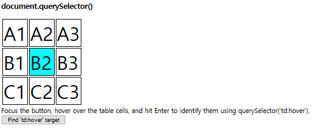

```html

<!DOCTYPE html>
<html>

<head>
  <meta charset="utf-8" />
  <title>Query Selector Demo</title>

  <style type="text/css">
    td {
      border-style: solid;
      border-width: 1px;
      font-size: 300%;
    }

    td:hover {
      background-color: cyan;
    }

    #hoverResult {
      color: green;
      font-size: 200%;
    }
  </style>
  <script>
    window.onload= function(){
      document.getElementById("findHover").onclick=function(){
        var hovered = document.querySelector("td:hover")
        if(hovered)
        document.getElementById("hoverResult").innerHTML=
        hovered.innerHTML;
      }
    }
  </script>
</head>

<body>
<h3> document.querySelector() </h3>
  <section>
    <!-- create a table with a 3 by 3 cell display -->
    <table>
      <tr>
        <td>A1</td> <td>A2</td> <td>A3</td>
      </tr>
      <tr>
        <td>B1</td> <td>B2</td> <td>B3</td>
      </tr>
      <tr>
        <td>C1</td> <td>C2</td> <td>C3</td>
      </tr>

    </table>
    <div>Focus the button, hover over the table cells, and hit Enter to identify them using querySelector('td:hover').</div>
    <button type="button" id="findHover" autofocus>Find 'td:hover' target</button>
    <div id="hoverResult"></div>


  </section>

</body>
</html>

```

