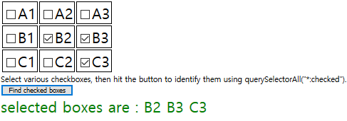

```html
<!DOCTYPE html>
<html>

<head>
  <meta charset="utf-8" />
  <title>Query Selector All Demo</title>

  <style type="text/css">
    td {
      border-style: solid;
      border-width: 1px;
      font-size: 200%;
    }


    #checkedResult {
      color: green;
      font-size: 200%;
    }
  </style>

</head>

<body>


<script>
  window.onload= function(){
    document.getElementById("findChecked").onclick=function(){
      var choose = document.querySelectorAll("*:checked")
      var result = "selected boxes are : "
      for( var i = 0 ;i<choose.length ; i++){
        result+=(choose[i].name + " ");
      }
      document.getElementById("checkedResult").innerHTML=result;
    }
  }

</script>

  <section>

    <table>
      <tr>
        <td><input type="checkbox" name="A1">A1</td>
        <td><input type="checkbox" name="A2">A2</td>
        <td><input type="checkbox" name="A3">A3</td>
      </tr>

      <tr>
        <td><input type="checkbox" name="B1">B1</td>
        <td><input type="checkbox" checked name="B2">B2</td>
        <td><input type="checkbox" name="B3">B3</td>
      </tr>

      <tr>
        <td><input type="checkbox" name="C1">C1</td>
        <td><input type="checkbox" name="C2">C2</td>
        <td><input type="checkbox" name="C3">C3</td>
      </tr>

    </table>
    <div>Select various checkboxes, then hit the button to identify them using querySelectorAll("*:checked").</div>
    <button type="button" id="findChecked" autofocus>Find checked boxes</button>
    <div id="checkedResult"></div>


  </section>

</body>

</html>

```

