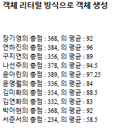

## 생성자 함수

- *동일한 속성을 가지는 객체를 하나 이상 생성해야 할 경우* 객체 리터럴 방식보다는 **생성자 함수**를 정의하고,
  생성자 함수로부터 **property값만 전달해서 객체를 생성하는 것**을 권장함.
- 생성자 함수로 생성되는 객체들의 <u>기능은 모두 동일</u>하므로 객체 생성시마다 메모리에 객체의 메서드가 생성되는 것보다는 생성자 함수는 *function 객체*로 메모리에 생성될 때 프로토타입 속성객체가 자동으로 생성이 됩니다.
- 프로토타입 속성객체에 생성자 함수로 생성되는 객체들의 기능을 추가하면, <u>전역 메서드처럼 사용 가능</u>합니다. 메모리의 낭비를 줄일 수 있다

```html
<!DOCTYPE html>
<html lang="en">
<head>
  <meta charset="UTF-8">

  <title>객체 생성</title>
</head>
<body>
  <h3>객체 리터럴 방식으로 객체 생성</h3><br>
<br>
  <script>
    //객체 생성을 위한 생성자 함수 정의
    function Student (name, ko, math, en, sci){
      this.name = name;
      this.ko=ko;
      this.math=math;
      this.en=en;
      this.sci=sci;
    }
      Student.prototype.total= function (){
        return this.ko + this.math + this.en + this.sci;

      },
      Student.prototype.average = function (){
      return this.total()/4;
      }

    console.dir(Student);
var student = [new Student('장기영',87,98,88,95),
                new Student('연하진',92,98,96,98),
                new Student('구지연',76,96,94,90),
                new Student('나선주',98,92,96,92),
                new Student('윤아린',95,98,98,98),
                new Student('윤명월',64,88,92,92),
                new Student('김미화',82,86,98,88),
                new Student('김연화',88,74,78,92),
                new Student('박아현',87,98,88,95),
                new Student('서준서',45,52,72,65)
];
for (var idx in student){
  document.write(student[idx].name + "의 총점 : "+ student[idx].total() + ", 의 평균 : "+ student[idx].average()+"<br />");
}
  </script>
</body>
</html>

```



