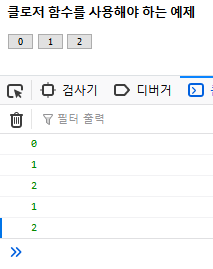

```html

<!DOCTYPE html>
<html lang="en">
<head>
  <meta charset="UTF-8">

  <title>클로저 함수 예제</title>
  <script >

//기존 문제점
     window.onload = function(){
       var buttons=document.getElementsByTagName("input")
       for(var i = 0 ; i<buttons.length;i++){
    
         buttons[i].onclick=function(){
           console.log(i);
         }
       	}//for end ; i: 3  3 이출력 되므로 로컬변수를 이용하도록 함
       }

//방법 1.
    window.onload = function(){
      var buttons=document.getElementsByTagName("input") //getElements는 배열로 가져오고 태그 네임의 input은 3가지이다.  -> 배열을 for문으로 이용
      for(var i = 0 ; i<buttons.length;i++){
        let _i= i //고정 let _0
        buttons[_i].onclick=function(){ // buttons[_0].onclick= function(){ console.log(_0)}
          console.log(_i); //_0 
        }
      }//for end
    }

//방법 2. 클로저 함수 이용
    window.onload = function(){
      var buttons=document.getElementsByTagName("input")
      for(var i = 0 ; i<buttons.length;i++)(function(_i){
        buttons[_i].onclick=function(){
            
          console.log(_i);
          }
        }
      )(i); //반복문의 i
    }

  </script>
</head>
<body>
  <h3>클로저 함수를 사용해야 하는 예제</h3>
  <input type="button" value="0">
  <input type="button" value="1">
  <input type="button" value="2">
</body>
</html>

```

