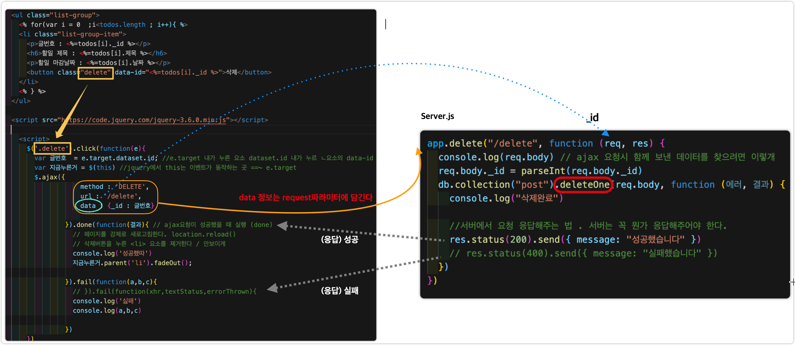

express 라이브러리 설치하기

1. npm init : package.json을 설정해줌

npm : 라이브러리 설치를 도와주는 도구

어떤 라이브러리를 설치했는지 기록하면 좋음. --> package.json에 기록함 


2. npm intall express

   node_modules가 생성된다. 그 안에 express폴더도 같이 생성됨


GET요청을 처리해보자

.1 서버 만들기

서버를 띄우기 위한 기본 셋팅 (express 라이브러리)

```javascript
const express = require("express")

const app = express()

app.listen(8080, function () {
  console.log("listening on 8080")
})

app.get("/pet", function (request, response) {
  response.send("hello PET acc shop")
})

app.get("/beauty", function (request, response) {
  response.send("hello Beauty acc shop")
})


위의 GET 요청을 하면 hello~ 글들이 나타난다.
```


2. Nodemon 라이브러리

변경사항이 있을 때마다 서버를 껐다가 다시 켜야 하는 불편함을 보완해주는 라이브러리

`npm install -g nodemon`

Permission 오류가 나면 ?

`sudo chown -R $USER (오류난 경로)/usr/local/lib/node_modules` 


실행

`nodemon server.js`


서버에서 html 전송

response.sendFile()

__dirname : 현재경로

sendFile() : 파일을 보낼 수 있다.

```javascript

app.get("/", function (request, response) {
  //   response.send("무야호~")
  response.sendFile(__dirname + "/index.html")
  server.js랑 같은 경로에 있는 /index.html이라는 파일을 보내줌
})

```


form에서 정보 입력하기

1. write.html

   ```html
   <!DOCTYPE html>
   <html lang="en">
     <head>
       <meta charset="UTF-8" />
       <meta name="viewport" content="width=device-width, initial-scale=1.0" />
       <title>Document</title>
       <link
         href="https://cdn.jsdelivr.net/npm/bootstrap@5.0.0-beta3/dist/css/bootstrap.min.css"
         rel="stylesheet"
         integrity="sha384-eOJMYsd53ii+scO/bJGFsiCZc+5NDVN2yr8+0RDqr0Ql0h+rP48ckxlpbzKgwra6"
         crossorigin="anonymous"
       />
     </head>
     <body>
       <div class="container m-5">
         <form action="/add" method="POST">
           <div class="form-group mb-3">
             <label for="exampleInputEmail1">Todo</label>
             <input type="text" class="form-control" name="title" />
           </div>
           <div class="form-group mb-3">
             <label for="exampleInputPassword1">Due Date</label>
             <input type="date" class="form-control" name="date" />
           </div>
   
           <button type="submit" class="btn btn-primary">Submit</button>
         </form>
       </div>
       <script
         src="https://cdn.jsdelivr.net/npm/bootstrap@5.0.0-beta3/dist/js/bootstrap.bundle.min.js"
         integrity="sha384-JEW9xMcG8R+pH31jmWH6WWP0WintQrMb4s7ZOdauHnUtxwoG2vI5DkLtS3qm9Ekf"
         crossorigin="anonymous"
       ></script>
     </body>
   </html>
   ```

   중요한 것 !

   1. form 태그 안에서 **action , method**
   2. input 태그 안에서 **name**

   

2. 전송버튼을 누르면 js에서 해야 할 일

   ```javascript
   // 어떤 사람이 /add 경로로 post요청을 하면
   // ~~~를 해주세요
   app.post("/add", function (req, res) {
     res.send("전송완료")
     console.log(req.body.date)
   })
   
   
   요청된 정보들은 req에 저장되어 있다.
   콘솔에 출력해보면 req.body 오브젝트 형태로 나옴
   ```

   

이제 영구적으로 저장 (DB에 저장)할 단계가 남음


그전에 

REST API ?

- API ?
  
- 어떤식으로 통신할 것인지에 대한 규약
  
- 웹개발 환경에서의 API ?

  - 서버와 고객간의 요청 방식  (소통방법)
  - 어떻게 해야 서버랑 통신할 수 있을까

  


인터넷이 발달하던 시절 일관성도 없고 막 만들었기 때문에 어려움

REST 원칙에 의해서 쓰면 아름답다

**원칙 6개**

1. **uniform interface**

   하나의 자료는 하나의 URL로

   URL은 예측 가능해야함

2. Client-Server 역할 구분

   브라우저는 요청만 할 뿐, 서버는 응답만 할 뿐

3. Stateless

   고객들이 요청 시 각각의 요청들은 독립적인 존재로 다루어야 함. 

   요청 1과 요청 2는 의존성이 없어야함

4. Cachable

   크롬이 알아서 잘 해줌

5. Layered System

6. Code on Demand


**이름짓기 원칙**

1. 명사로 작성 추천
2. 하위문서를 나타낼 땐 /
3. 파일확잣자(.html) 쓰지 말기
4. 띄어쓰기는 ( - ) 사용
5. 자료 하나당 하나의 URL


웹사이트 기능만들기 기본

1. 서버로 데이터 전송할 UI만들고
2. 서버에서 원하는대로 정보를 처리해주면 됨


DB종류

1. 관계형
   1. 엑셀처럼 행과 열이 나누어져 있는 데이터베이스
   2. 3차원의 데이터들은 다루지 못한다.
   3. 그래서 다른 테이블들을 만들어 join등을 하며 해결한다.
   4. SQL이라는 언어를 사용해야 한다.
2. NoSQL
   1. Object 자료형으로 입출력 가능
   2. 대표적으로 **MongoDB**
   3. 무료로 호스팅을 받아 사용 가능
   4. MongoDB atlas


 /list로 GET요청으로 젖ㅂ속하면

// 실제 DB에 저장된 데이터들로 꾸며진 HTML을 보여줌


html

EJS

서버데이터를 집어넣을 수 있다.

대체품 : vue, react, angular


ejs파일들은 항상 views폴더에 있어야 한다.

 


게시물들 번호 매기기

```javascript
app.post("/add", function (req, res) {
  db.collection("post").insertOne(
    { _id: 총게시물갯수+1, 제목: req.body.title, 날짜: req.body.date },
    function (에러, 결과) {
      console.log("저장완료")
    }
  )
  res.send("전송완료")
  console.log(req.body.date)
})

```

다른 DB들은 auto increament가 있는데 몽고는 없다

총 게시물 갯수를 어떻게 구하냐 ?

count함수로 총 갯수를 구하는 방법 ? 비추

저장되는 시점에 따라 혼선유발 가능

글마다의 고유의 번호를 부여하자


1. .Counter라는 컬렉션을 만든다
2. 0을 부여하고
3. findOne(하나만 찾기 때문에) 을 사용해서 결과 값을 불러온다.
4. 불러온 결과값을 `총게시물갯수`  변수에 할당한다.
5. 글이 새로 생기면 counter라는 콜렉션에 있는 totalPost라는 항목도 1 증가시켜야 한다.


Update함수


operator

$set(변경)

$inc(증가)

$min(기존값보다 적을 때만 변경

$rename(key값 이름 변경)


글 삭제



DELETE요청

html에서 바로 delete, put를 요청할 수는 없음 (post, get은 되지만..)

1. 라이브러리 

   1.  **method-override** 라이브러리 : form에서 delete요청이 가능하게 된다.

2. Ajax요청을 한다.

   

