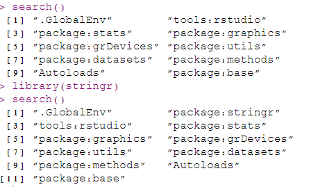
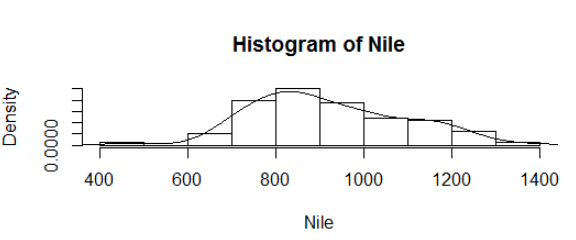
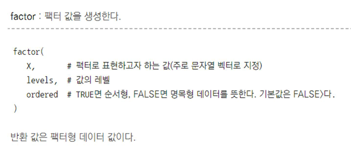
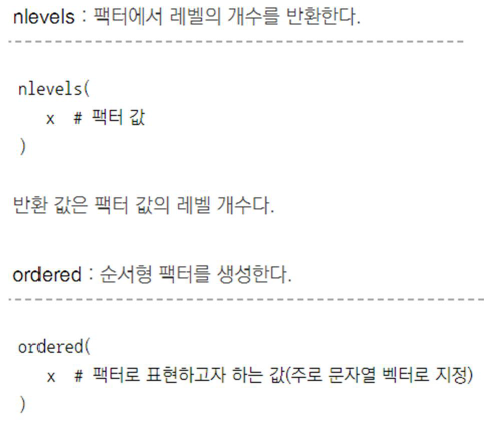
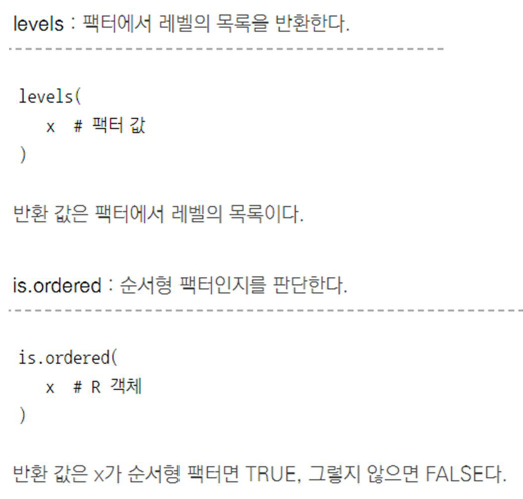
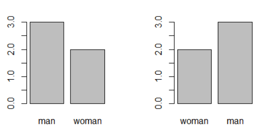

# R ?

- R은 데이터 분석을 위한 통계 및 그래픽스를 지원하는 자유 소프트웨어 환경이다
- R은 벨 연구소에서 만들어진 통계 분석 언어인 S에 두고 있다
- R은 현재 데이터 분석을 위한 도구로 많은 인기를 누리고 있다.
- R은 컴퓨터 언어이자 다양한 패키지의 집합이다
- R 안에서 대부분의 데이터 분석을 해낼 수 있다는 장점이 있다.
- R은 통계, 기계 학습, 금융, 생물정보학, 그래픽스에 이르는 다양한 통계 패키지를 갖추고 있으며 이 모든 것이 무료로 제공된다.
- R의 다양한 패키지는 CRAN(http://cran.r-project.org/web/views/)을 통해 한곳에서 살펴볼 수 있다.
- R은 공개 소프트웨어로 http://www.r-project.org/에서 다운로드해서 설치할 수 있다


## R 특성

- R은 **메모리**에서 모든 것을 처리
- Single thread를 사용
- 오픈 소스이므로 새로운 알고리즘이 빠르게 적용, 시험 된다
- 언어에 가까운 문장 형식을 사용해 자동화가 용이
- R은 입력된 명령을 1줄씩 바로 검사하고 처리하는 인터프리터 형태의 언어
- ` >`는 명령 프롬프트
- R은 대소문자를 다른 문자로 구별
- 이전 작업의 history기능은 방향키를 사용
- R종료는 q()를 사용
- 스크립트창을 열어서 코드를 입력하신 후 완성되면 해당 부분을 선택하고 CTRL+R을 눌러 실행하면 편리
- `# `기호는 주석

## R 패키지 

### 설치 

- 패키지 설치하기
  : install.package(“패키지명”)
- 패키지 사용하기
  : library(패키지명) / requrie(패키지명)명령
- 패키지 업데이트 
  : update.packages(“패키지명”)
- 패키지 삭제하기 
  : remove.packages(“패키지명”)
- 설치된 패키지 정보 확인 
  : librart(help=패키지명)
- CRAN 사이트에서 추가로 설치할 수 있는 패키지가 어떤 것들이 있는지 확인
  : available.packages()
- R패키지 개수 확인
  : dim(available.packages())
- 사용자가 R 프로그램을 시작한 후 R콘솔 시작 ~ 종료까지의 수행된 정보
  : sessioninfo()
- 설치된 R 패키지 목록 확인
  : installed.packages()


cf ) 종종 R studio에서 설치한 경로와 R GUI에서 설치한 경로가 달라 오류가 생기는 경우도 있음


### load

- 설치된 패키지를 사용하기 위해 메모리에 로드
  :  library(stringr) || require(stringr)




### 기능

- 기본 데이터셋 보기
  : data()

- 빈도수 히스토그램
  hist(Nile)

- 밀도 기준 히스토그램
  hist(Nile,freq=F)

- 분포곡선 그리기
  lines(density(Nile))
- 

- plot 영역에 표시할 그래프 개수 설정
  : par(mfrow=c(1,1))
- 파일 출력 경로
  : pdf("c:/workspaceR/sample.pdf")
- 정규분포를 따르는 난수 20개 생성해서 히스토그램 생성
  : hist(rnorm(20)) 
- 출력파일 닫기
  : dev.off()
- 


### 변수 선언

- 규칙 

  - R의 변수명은 알파벳, 숫자, _(언더스코어), .(마침표)로 구성되며, -(하이픈)은 사용할 수 없다.

  - 첫 글자는 알파벳 또는 .으로 시작해야 한다.

  -  첫 글자가 .으로 시작한다면 . 뒤에는 숫자가 올 수 없다.

  -  예약어는 사용할 수 없습니다.

  - 대소문자 구분

  - 변수에 저장된 값은 불변  (새로운 주소값이 부여된다)

    - ```R
      > x <- 3
      > tracemem(x)
      [1] "<0000000010B0CE18>"
      > x <- 'a'
      > tracemem(x) 
      [1] "<0000000010A7BCF8>"
      ```

      

  - R은 변수 선언 시 자료형 (Type) 선언하지 않음.

### 데이터 타입

- - Scalar 변수 
    : 단일 값 (하나의  값) 을 저장하는 변수

  - 벡터(Vector)
    : 하나 이상의 여러개 자료를 저장 가능 한 1차원의 선형 자료 구조 (1차원 배열)

    - age <- 30
      age 변수는 하나의 값을 저장하고 있는 벡터 타입

      `[1] "numeric"`

    - age<- "29"
      class(age)

      `[1] "character"`

    - ```R
      #방법1
      age <-TRUE  #상수객체(TRUE, FALSE)
      class(age)
      `[1] "logical"`
      ```

      ```R
      #방법2
      # T 변수에 TRUE 저장, F 변수에 FALSE 저장
      age <- F
      class(age)
      ```

    - ```R
      name <-NA   #결측치 (Not Availabe : 연산불가)
      class(name)
      `[1] "logical"`
      ```

    - ```age <- NA
      class(age+19)
      `[1] "numeric"
      
      age<-null
      Error: object 'null' not found
      
      class(age+10)
      `[1] "numeric"
      ```

    - **na.rm=T**  
      : NA 무시하고 계산

      ```
      > sum(10,20,30)
      [1] 60
      > sum(10,20,30,NA)
      [1] NA
      > sum(10,20,30,NA,na.rm=T)
      [1] 60
      ```

    

  - is()
    : R session에서 생성한 변수 목록 확인

- - 자료형 확인
    - is.numeric(변수)
    - is.logical(변수)
    - is.character(변수)
    - is.na(변수)
    - is.list(객체)
    - is.data.frame(객체)
    - is.array(객체)
    - is.matrix(객체)

- - 자료형 형변환

    - as.numeric(변수)
    - as.logical(변수)
    - as.character(변수)
    - as.list(객체)
    - as.data.frame(객체)
    - as.array(객체)
    - as.matrix(객체)
    - as.integer(변수)
    - as.double(변수)
    - as.complex(변수)
    - as.factor(객체)
    - as.Date(객체)

  - as.numeric, as.integer 실습

    ```R
    > x<-c("1","2","3")
    
    > result <- x*3
    Error in x * 3 : non-numeric argument to binary operator
    > print(result)
    Error in print(result) : object 'result' not found  # 형변환 필요!
    
    > result <- as.numeric(x) * 3
    > print(result)
    [1] 3 6 9
    
    > result <- as.integer(x) * 3
    > print(result)
    [1] 3 6 9
    ```

  - complex 자료형 실습

    ```R
    > z <- 5.3-3i #복소수 자료형 생성
    
    > class(z)
    [1] "complex"
    
    > Re(z) #실수부만
    [1] 5.3
    > Im(z) #허수부만
    [1] -3
    
    > is.complex(z)
    [1] TRUE
    > as.complex(5.3)
    [1] 5.3+0i
    ```

- class(변수)는 자료구조의 Type반환
  mode (변수)는 자료의 Type반환

  - ```R
    age <- 29.5
    mode(age)
    [1] "numeric"
    
    > age <- "29"
    > mode(age)
    [1] "character"
    
    > age <- TRUE    
    > mode(age) 
    [1] "logical"
    
    > age <-F
    > mode(age)
    [1] "logical"
    ```

- 현재 디렉토리 출력 
  : getwd()

- 작업 디렉토리 설정
  : setwd("c:/workspace")

- print()

  - ```R
    > print(3, 4)
    [1] 3
    ```

- cat()

  - ```R
    > cat(1, 'a', 2, 'b')
    1 a 2 b
    ```

- 여러 개의 명령을 연속적으로 실행하고 싶을 경우에 세미콜론(;)을 사용

  - ```R
    > 1+2 ; 3*2 ; 4/2
    [1] 3
    [1] 6
    [1] 2
    ```

- 산술연산자

- NULL 
  : NULL은 NULL 객체를 뜻하며, 변수가 초기화되지 않았을 때 사용한다.

  - NA는 결측치, 즉 값이 빠져 있는 경우를 뜻한다
    NULL은 프로그래밍의 편의를 위해 미정(undefined) 값을 표현하는 데 사용하는 개념이다.

  - ```R
    > x <- NULL
    > is.null(x)
    [1] TRUE
    
    > is.null(1)
    [1] FALSE
    
    > is.null(NA)
    [1] FALSE
    
    > is.na(NULL)
    logical(0)
    ```

- 진리값

  - TRUE, T는 모두 참 값을 의미

  - FALSE, F는 거짓 값을 의미

  - 진릿값에는 &(AND), |(OR), !(NOT) 연산자를 사용할 수 있다.

  - TRUE와 FALSE는 예약어reserved word고 T, F는 각각 TRUE와 FALSE로 초기화된 전역 변수다.

  - ```R
    > TRUE & TRUE
    [1] TRUE
    
    > TRUE & FALSE
    [1] FALSE
    
    > TRUE | TRUE
    [1] TRUE
    
    > TRUE | FALSE
    [1] TRUE
    
    > !TRUE
    [1] FALSE
    
    > !FALSE
    [1] TRUE
    
    > T <- FALSE
    > TRUE <- FALSE
    Error in TRUE <- FALSE : invalid (do_set) left-hand side to assignment
    
    > c(TRUE, TRUE) & c(TRUE, FALSE)
    [1]  TRUE FALSE
    
    > c(TRUE, TRUE) && c(TRUE, FALSE)
    [1] TRUE
    ```

- 날짜와 시간

  - ```R
    > Sys.Date() # 날짜만 보여주는 함수
    [1] "2019-09-05"
    
    > Sys.time() # 날짜와 시간을 보여주는 함수
    [1] "2019-09-05 16:33:02 KST"
    
    > date() # 미국식 날짜와 시간을 출력하는 함수
    [1] "Thu Sep 05 16:33:02 2019"
    
    > as.Date('2017-12-01') # 문자형태의 날짜를 날짜타입으로 변환해주는 함수
    [1] "2017-12-01"
    
    > as.Date('2017/07/04')
    [1] "2017-07-04"
    
    > as.Date('04-07-2017') #오류
    [1] "0004-07-20"
    
    > as.Date('2017-12-01' , format='%Y-%m-%d')
    [1] "2017-12-01"
    
    > as.Date(10, origin='2017-12-01') #주어진 날짜 기준으로 10일후의 날짜
    [1] "2017-12-11"
    
    > as.Date(-10, origin='2017-12-01') #주어진 날짜 기준으로 10일 이전 날짜
    [1] "2017-11-21"
    ```

  - 포맷 설정이 안될때 로케일 설정을 해준다

    ```R
    #Sys.setlocale(category="LC_ALL", locale="언어_국가")
    #현재 로케일 정보 전체 확인
    Sys.setlocale(category="LC_ALL", locale="")
    Sys.setlocale(category="LC_ALL", locale="Korean_Korea")
    Sys.setlocale(category="LC_ALL", locale="English_US") 
    Sys.setlocale(category="LC_ALL", locale="Japanese_Japan")
    ```

  - 날짜 format

    -  %d 일자를 숫자로 인식
    -  %m 월 을 숫자로 인식
    -  %b 월을 영어 약어로 인식
    -  %B 월을 전체 이릉으로 인식
    -  %y 년도를 숫자 두 자리로 인식
    -  %Y 년도를 숫자 네 자리로 인식

  - 날짜 산술 연산

    - ```R
      > as.Date("2017-07-31")-as.Date("2017-07-04")
      
      Time difference of 27 days
      ```

    - POSIXt : 날짜를 년, 월, 일 로 표시하는 리스트형 클래스
      POSIXct : 날짜를 연속적인 데이터로 인식해서 1970년을 기준으로 초 단위로 계산
      POSIXct 은 R고급 과정에서 회귀분석 등을 할 때 주로 POSIXct를 많이 사용

      - ```R
        > as.Date("2017-07-04 20:00:00 ")-as.Date("2017-07-04 18:30")
        Time difference of 0 days
        
        > as.POSIXct("2017-07-04 20:00:00 ")-as.POSIXct("2017-07-04 18:30")
        Time difference of 1.5 hours
        ```

    - lubridate 패키지로 날짜와 시간 제어하기

      ```R
      > library(lubridate)
      
      > date<-now() #현재 날짜와 시간 넣기
      
      > date
      [1] "2019-09-05 16:46:11 KST"
      
      > year(date) #년도만 출력
      [1] 2019
      
      > month(date,label=T) #월을 영문으로 출력
      [1] Sep
      12 Levels: Jan < Feb < Mar < Apr < May < ... < Dec
      
      > month(date,label=F) #월을 숫자로 출력
      [1] 9
      
      > day(date)
      [1] 5
      ```

- R에서 제공하는 기본 함수 사용 예제 보기
  : example(seq)
- R에서 제공하는 함수의 파라미터 형식 보기
  : args(max)
- 도움말
  : help(mean), ?sum

### Factor 형
- 여러 번 중복으로 나오는 데이터들을 각 값으로 모아서 대표 값을 출력해 주는 형태

- stringsAsFactors=FALSE 옵션은 대표값으로 정리하지 않고 중복되는 상태 그대로 사용하게 해 줍
  니다.

- 범주형Categorical 데이터(자료)를 표현하기 위한 데이터 타입

- 범주형 데이터 
  : 데이터가 사전에 정해진 특정 유형으로만 분류되는 경우

  - 명목형 ( Nominal ) : 크기 구분 불가한 것
  - 순서형 (Ordinal ) : 대,중,소 크기가 구분 가능한 것

- factor

  

  - nlevel

    

  - levels

    

    - ```R
      > gender <-c("man","woman","woman","man","man")
      
      > plot(gender) # 차트는 수치데이터만 가능하므로 오류
      Error in plot.window(...) : need finite 'ylim' values
      In addition: Warning messages:
      1: In xy.coords(x, y, xlabel, ylabel, log) : NAs introduced by coercion
      2: In min(x) : no non-missing arguments to min; returning Inf
      3: In max(x) : no non-missing arguments to max; returning -Inf
      
      > class(gender)
      [1] "character"
      
      > mode(gender)
      [1] "character"
      
      > ngender <- as.factor(gender)
      
      > class(ngender)
      [1] "factor"
      
      > mode(ngender)
      [1] "numeric"
      
      > table(ngender)
      ngender
        man woman 
          3     2 
      
      > is.factor(ngender)
      [1] TRUE
      ```

    - levels

      ```R
      > ngender # Levels 속성에서 범주를 확인 (알파벳 순서인가?)
      [1] man   woman woman man   man  
      Levels: man woman
      ```

    - factor()함수의 매개변수 확인

      ```R
      > args(factor) #factor()함수의 매개변수확인인
      function (x = character(), levels, labels = levels, exclude = NA, 
          ordered = is.ordered(x), nmax = NA) 
      NULL
      ```

    - 범주의 순서 확인

      ```R
      > ogender <- factor(gender, levels<-c("woman","man"),ordered=T)
      
      > ogender #범주의 순서 확인
      [1] man   woman woman man   man  
      Levels: woman < man
      ```

    - 결과!

      ```R
      > par(mfrow=c(1,2))
      > plot(ngender)
      > plot(ogender)
      ```

      

---

### Vector 

​	: R에서 가장 기본이 되는 자료 구조 , 1차원, 선형구조

- 요소의 접근은 변수 [Index첨자]로 접근, 첨자 Index는 1부터 시작

- 동일한 데이터타입만 저장 가능

- 벡터생성함수 : c(), seq(), rep()

- 벡터 자료 처리 함수 : union(), setdiff(), intersect(), ....

- ```R
  > c(1:20)
   [1]  1  2  3  4  5  6  7  8  9 10 11 12 13 14 15 16 17
  [18] 18 19 20
  
  > 1:20
   [1]  1  2  3  4  5  6  7  8  9 10 11 12 13 14 15 16 17
  [18] 18 19 20
  
  > c(1,2,3,4,4,4,4,5,5,5,5)
   [1] 1 2 3 4 4 4 4 5 5 5 5
  
  > seq(1,20)
   [1]  1  2  3  4  5  6  7  8  9 10 11 12 13 14 15 16 17
  [18] 18 19 20
  
  > seq(1,20,2) #2씩 증가
   [1]  1  3  5  7  9 11 13 15 17 19
  
  > rep(1:3,3)  #replace
  [1] 1 2 3 1 2 3 1 2 3
  
  > rep(1:3, each=3)
  [1] 1 1 1 2 2 2 3 3 3
  ```

  

- vectorizing 연산

  ```R
  > a<-c(1:5)
  > b<-a+1
  > c<-a*2
  > b
  [1] 2 3 4 5 6
  > c
  [1]  2  4  6  8 10
  ```

- 집합

  ```R
  > d<-rep(1:3,3)
  > union(a,d)
  [1] 1 2 3 4 5
  > setdiff(a,d)
  [1] 4 5
  > intersect(a,d)
  [1] 1 2 3
  ```

- type 혼합 시 자동 형변환

  ```R
  > f<-c(33,-5,"a",5:9)  # 자료형이 혼합된 경우, 문자열이 포함된 경우, 문자열로 자동 형변환
  > mode(f)
  [1] "character"
  > class(f)
  [1] "character"
  ```

- 벡터 요소에 접근

  ```R
  > a<-c(1:20)
  > a[3:10]
  [1]  3  4  5  6  7  8  9 10
  
  > a[c(3,10)]
  [1]  3 10
  
  > a[-c(2:18)] # 벡터의 첨자에 - 지정하면 해당 위치의 원소는 제외
  [1]  1 19 20
  ```

  