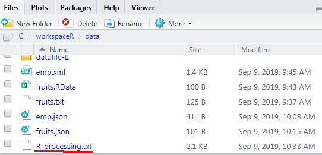
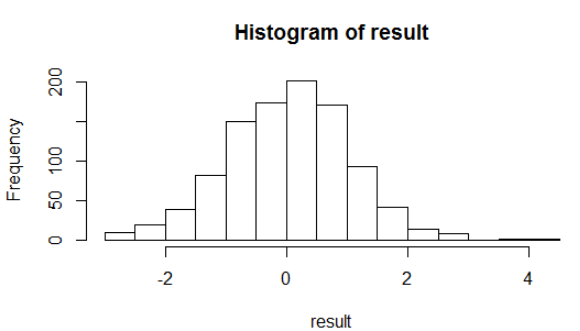
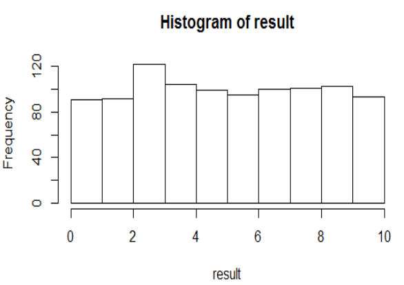
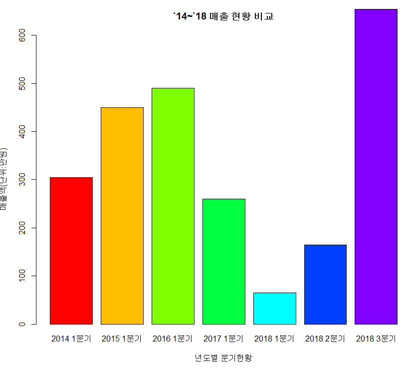
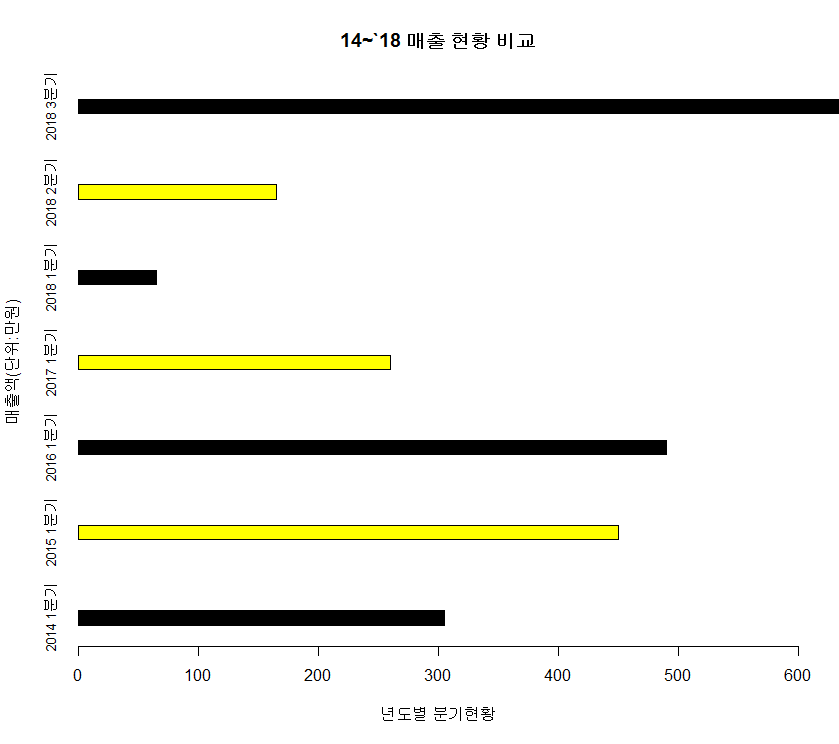
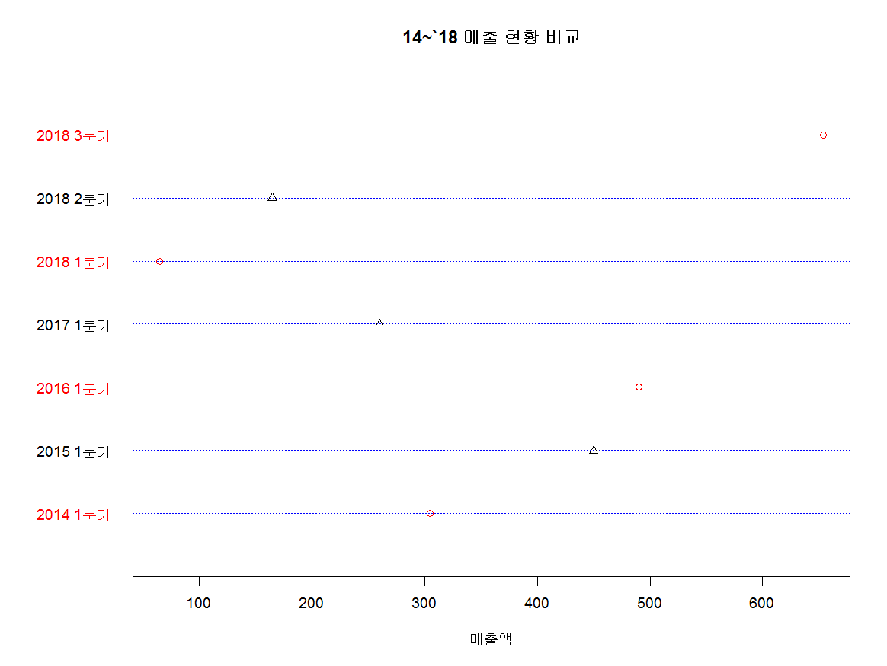
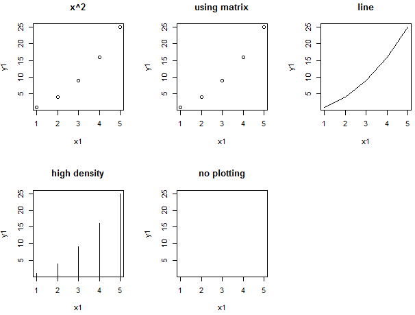

헤더를 제외한 레코드 2개 skip(제외)하고, 2개의 record만 읽어옴

fruits  <- read.table("./data/fruits.txt", header=T, skip=2, nrows=2)
print(fruits )
str(fruits)
class(fruits)

#R객체를 바이너리 파일로 저장 save(), load()
str(fruits)
save(fruits, file="./output/fruits.RData")
rm(list=ls())


### XML 구조의 파일을 Read/Write

1. 원본xml

```xml
<RECORDS>
   <EMPLOYEE>
      <ID>1</ID>
      <NAME>Rick</NAME>
      <SALARY>623.3</SALARY>
      <STARTDATE>1/1/2012</STARTDATE>
      <DEPT>IT</DEPT>
   </EMPLOYEE>
	
   <EMPLOYEE>
      <ID>2</ID>
      <NAME>Dan</NAME>
      <SALARY>515.2</SALARY>
      <STARTDATE>9/23/2013</STARTDATE>
      <DEPT>Operations</DEPT>
   </EMPLOYEE>

   <EMPLOYEE>
      <ID>3</ID>
      <NAME>Michelle</NAME>
      <SALARY>611</SALARY>
      <STARTDATE>11/15/2014</STARTDATE>
      <DEPT>IT</DEPT>
   </EMPLOYEE>

   <EMPLOYEE>
      <ID>4</ID>
      <NAME>Ryan</NAME>
      <SALARY>729</SALARY>
      <STARTDATE>5/11/2014</STARTDATE>
      <DEPT>HR</DEPT>
   </EMPLOYEE>

   <EMPLOYEE>
      <ID>5</ID>
      <NAME>Gary</NAME>
      <SALARY>843.25</SALARY>
      <STARTDATE>3/27/2015</STARTDATE>
      <DEPT>Finance</DEPT>
   </EMPLOYEE>

   <EMPLOYEE>
      <ID>6</ID>
      <NAME>Nina</NAME>
      <SALARY>578</SALARY>
      <STARTDATE>5/21/2013</STARTDATE>
      <DEPT>IT</DEPT>
   </EMPLOYEE>

   <EMPLOYEE>
      <ID>7</ID>
      <NAME>Simon</NAME>
      <SALARY>632.8</SALARY>
      <STARTDATE>7/30/2013</STARTDATE>
      <DEPT>Operations</DEPT>
   </EMPLOYEE>

   <EMPLOYEE>
      <ID>8</ID>
      <NAME>Guru</NAME>
      <SALARY>722.5</SALARY>
      <STARTDATE>6/17/2014</STARTDATE>
      <DEPT>Finance</DEPT>
   </EMPLOYEE>
	
</RECORDS>
```

2. XML 또는 HTML 문서를 가져오기 위해서 httr과 XML 패키지를 설치합니다.

```r
install.packages("XML")
library(XML)
data2 <- xmlParse(file="./data/emp.xml")
print(data2)

> str(data2)
	Classes 'XMLInternalDocument', 'XMLAbstractDocument' <externalptr> 
```

```R
> #Root Node만 추출
> rootnode <- xmlRoot(data2)
> print(rootnode)
<RECORDS>
  <EMPLOYEE>
    <ID>1</ID>
    <NAME>Rick</NAME>
    <SALARY>623.3</SALARY>
    <STARTDATE>1/1/2012</STARTDATE>
    <DEPT>IT</DEPT>
  </EMPLOYEE>
  <EMPLOYEE>
    <ID>2</ID>
    <NAME>Dan</NAME>
    <SALARY>515.2</SALARY>
    <STARTDATE>9/23/2013</STARTDATE>
    <DEPT>Operations</DEPT>
  </EMPLOYEE>
  <EMPLOYEE>
    <ID>3</ID>
    <NAME>Michelle</NAME>
    <SALARY>611</SALARY>
    <STARTDATE>11/15/2014</STARTDATE>
    <DEPT>IT</DEPT>
  </EMPLOYEE>
  <EMPLOYEE>
    <ID>4</ID>
    <NAME>Ryan</NAME>
    <SALARY>729</SALARY>
    <STARTDATE>5/11/2014</STARTDATE>
    <DEPT>HR</DEPT>
  </EMPLOYEE>
  <EMPLOYEE>
    <ID>5</ID>
    <NAME>Gary</NAME>
    <SALARY>843.25</SALARY>
    <STARTDATE>3/27/2015</STARTDATE>
    <DEPT>Finance</DEPT>
  </EMPLOYEE>
  <EMPLOYEE>
    <ID>6</ID>
    <NAME>Nina</NAME>
    <SALARY>578</SALARY>
    <STARTDATE>5/21/2013</STARTDATE>
    <DEPT>IT</DEPT>
  </EMPLOYEE>
  <EMPLOYEE>
    <ID>7</ID>
    <NAME>Simon</NAME>
    <SALARY>632.8</SALARY>
    <STARTDATE>7/30/2013</STARTDATE>
    <DEPT>Operations</DEPT>
  </EMPLOYEE>
  <EMPLOYEE>
    <ID>8</ID>
    <NAME>Guru</NAME>
    <SALARY>722.5</SALARY>
    <STARTDATE>6/17/2014</STARTDATE>
    <DEPT>Finance</DEPT>
  </EMPLOYEE>
</RECORDS> 

> class(rootnode)
[1] "XMLInternalElementNode" "XMLInternalNode"       
[3] "XMLAbstractNode"       

> str(rootnode)
Classes 'XMLInternalElementNode', 'XMLInternalNode', 'XMLAbstractNode' <externalptr> 

> #rootnode의 자식 노드 개수
> rootsize <- xmlSize(rootnode)
> print(rootsize)
[1] 8

> #rootnode의 첫번째 자식 노드 출력
> print(rootnode[1])
$EMPLOYEE
<EMPLOYEE>
  <ID>1</ID>
  <NAME>Rick</NAME>
  <SALARY>623.3</SALARY>
  <STARTDATE>1/1/2012</STARTDATE>
  <DEPT>IT</DEPT>
</EMPLOYEE> 

attr(,"class")
[1] "XMLInternalNodeList" "XMLNodeList"        

> #rootnode의 첫번재 자식 노드의 이름과 부서와 급여 출력
> print(rootnode[[1]][[2]]);
<NAME>Rick</NAME> 

> print(rootnode[[1]][[3]]);
<SALARY>623.3</SALARY> 

> print(rootnode[[1]][[5]]);
<DEPT>IT</DEPT> 

> #XML을 R의 지원형식인 data.frame으로 로딩
> xmldataframe <- xmlToDataFrame("./data/emp.xml")
> print(xmldataframe)
  ID     NAME SALARY  STARTDATE       DEPT
1  1     Rick  623.3   1/1/2012         IT
2  2      Dan  515.2  9/23/2013 Operations
3  3 Michelle    611 11/15/2014         IT
4  4     Ryan    729  5/11/2014         HR
5  5     Gary 843.25  3/27/2015    Finance
6  6     Nina    578  5/21/2013         IT
7  7    Simon  632.8  7/30/2013 Operations
8  8     Guru  722.5  6/17/2014    Finance

> str(xmldataframe)
'data.frame':	8 obs. of  5 variables:
 $ ID       : Factor w/ 8 levels "1","2","3","4",..: 1 2 3 4 5 6 7 8
 $ NAME     : Factor w/ 8 levels "Dan","Gary","Guru",..: 6 1 4 7 2 5 8 3
 $ SALARY   : Factor w/ 8 levels "515.2","578",..: 4 1 3 7 8 2 5 6
 $ STARTDATE: Factor w/ 8 levels "1/1/2012","11/15/2014",..: 1 8 2 4 3 5 7 6
 $ DEPT     : Factor w/ 4 levels "Finance","HR",..: 3 4 3 2 1 3 4 1
```


### JSON 데이터 Read/Write

```json
{ 
   "ID": ["1","2","3","4","5","6","7","8" ],
   "Name":["Rick","Dan","Michelle","Ryan","Gary","Nina","Simon","Guru" ],
   "Salary":["623.3","515.2","611","729","843.25","578","632.8","722.5" ],
   
   "StartDate":[ "1/1/2012","9/23/2013","11/15/2014","5/11/2014","3/27/2015","5/21/2013",
      "7/30/2013","6/17/2014"],
   "Dept":[ "IT","Operations","IT","HR","Finance","IT","Operations","Finance"]
}
```

```R
> library(rjson)
> rm(list=ls())
> data1<- fromJSON(file="./data/emp.json")
> print(data1)
$ID
[1] "1" "2" "3" "4" "5" "6" "7" "8"

$Name
[1] "Rick"     "Dan"      "Michelle" "Ryan"    
[5] "Gary"     "Nina"     "Simon"    "Guru"    

$Salary
[1] "623.3"  "515.2"  "611"    "729"    "843.25"
[6] "578"    "632.8"  "722.5" 

$StartDate
[1] "1/1/2012"   "9/23/2013"  "11/15/2014" "5/11/2014" 
[5] "3/27/2015"  "5/21/2013"  "7/30/2013"  "6/17/2014" 

$Dept
[1] "IT"         "Operations" "IT"         "HR"        
[5] "Finance"    "IT"         "Operations" "Finance"   

> str(data1)
List of 5
 $ ID       : chr [1:8] "1" "2" "3" "4" ...
 $ Name     : chr [1:8] "Rick" "Dan" "Michelle" "Ryan" ...
 $ Salary   : chr [1:8] "623.3" "515.2" "611" "729" ...
 $ StartDate: chr [1:8] "1/1/2012" "9/23/2013" "11/15/2014" "5/11/2014" ...
 $ Dept     : chr [1:8] "IT" "Operations" "IT" "HR" ...

> emp.dataframe <-as.data.frame(data1)
> print(emp.dataframe)
  ID     Name Salary  StartDate       Dept
1  1     Rick  623.3   1/1/2012         IT
2  2      Dan  515.2  9/23/2013 Operations
3  3 Michelle    611 11/15/2014         IT
4  4     Ryan    729  5/11/2014         HR
5  5     Gary 843.25  3/27/2015    Finance
6  6     Nina    578  5/21/2013         IT
7  7    Simon  632.8  7/30/2013 Operations
8  8     Guru  722.5  6/17/2014    Finance

> str(emp.dataframe)
'data.frame':	8 obs. of  5 variables:
 $ ID       : Factor w/ 8 levels "1","2","3","4",..: 1 2 3 4 5 6 7 8
 $ Name     : Factor w/ 8 levels "Dan","Gary","Guru",..: 6 1 4 7 2 5 8 3
 $ Salary   : Factor w/ 8 levels "515.2","578",..: 4 1 3 7 8 2 5 6
 $ StartDate: Factor w/ 8 levels "1/1/2012","11/15/2014",..: 1 8 2 4 3 5 7 6
 $ Dept     : Factor w/ 4 levels "Finance","HR",..: 3 4 3 2 1 3 4 1

> fruits1 <- read.table("./data/fruits.txt", header=T, stringsAsFactors = 2)
> print(fruits1)
  no   name price qty
1  1  apple   500   5
2  2 banana   200   2
3  3  peach   200   7
4  4  berry    50   9
> str(fruits1)
'data.frame':	4 obs. of  4 variables:
 $ no   : int  1 2 3 4
 $ name : Factor w/ 4 levels "apple","banana",..: 1 2 4 3
 $ price: int  500 200 200 50
 $ qty  : int  5 2 7 9
> class(fruits1)
[1] "data.frame"

> result<- toJSON(fruits1)
> print(result)
[1] "{\"no\":[1,2,3,4],\"name\":[\"apple\",\"banana\",\"peach\",\"berry\"],\"price\":[500,200,200,50],\"qty\":[5,2,7,9]}"
> str(result)
 chr "{\"no\":[1,2,3,4],\"name\":[\"apple\",\"banana\",\"peach\",\"berry\"],\"price\":[500,200,200,50],\"qty\":[5,2,7,9]}"

> write(result,"./data/fruits.json")

> list.files("./data/")
[1] "datafile-I"   "datafile-II"  "emp.json"    
[4] "emp.xml"      "fruits.json"  "fruits.RData"
[7] "fruits.txt"  
```


### HTML

- httr 패키지는 지정한 url의 HTML소스를 가져오는 GET() 함수를 제공하고 

  `<table>` 태그의 내용을 읽어올 수 있는 readHTMLTable()함수를 제공합니다.

- readHTMLTable()에 사용되는 속성 
  - get_url$content  : GET(url)함수에 의해서 가져온 HTML소스의 내용
  - rawToChar() : 바이너리(binary) 소스를 HTML 태그로 변환
  - stringsAsFactors = F : 문자열을 요인으로 처리하지 않고 순수한 문자열로 가져오기


```R
> library(httr)
> url<-"https://ssti.org/blog/useful-stats-capita-personal-income-state-2010-2015"
> get_url <- GET(url)
> html_cont <- readHTMLTable(rawToChar(get_url$content),stringAsFactor=F)

> str(html_cont)
List of 1
 $ NULL:'data.frame':	52 obs. of  7 variables:
  ..$ State: Factor w/ 52 levels "Alabama","Alaska",..: 45 1 2 3 4 5 6 7 8 9 ...
  ..$ 2010 : Factor w/ 52 levels "$30,783","$31,991",..: 32 9 46 10 2 38 35 51 34 52 ...
  ..$ 2011 : Factor w/ 52 levels "$31,976","$33,544",..: 29 9 46 10 3 40 38 51 32 52 ...
  ..$ 2012 : Factor w/ 52 levels "$33,127","$34,846",..: 29 8 45 10 9 41 38 51 32 52 ...
  ..$ 2013 : Factor w/ 52 levels "$33,629","$35,163",..: 30 7 44 10 8 41 38 51 32 52 ...
  ..$ 2014 : Factor w/ 52 levels "$34,431","$36,132",..: 31 7 44 10 9 41 38 51 32 52 ...
  ..$ 2015 : Factor w/ 52 levels "$35,444","$37,047",..: 31 6 46 9 10 42 38 51 30 52 ...

> class(html_cont)
[1] "list"

> html_cont<-as.data.frame(html_cont)

> head(html_cont)
     NULL.State NULL.2010 NULL.2011 NULL.2012
1 United States   $40,277   $42,453   $44,266
2       Alabama   $34,073   $35,202   $36,036
3        Alaska   $47,773   $50,552   $52,269
4       Arizona   $34,185   $35,675   $36,788
5      Arkansas   $31,991   $33,961   $36,291
6    California   $42,411   $44,852   $47,614
  NULL.2013 NULL.2014 NULL.2015
1   $44,438   $46,049   $47,669
2   $36,176   $37,512   $38,965
3   $51,259   $54,012   $55,940
4   $36,723   $37,895   $39,060
5   $36,529   $37,782   $39,107
6   $48,125   $49,985   $52,651

> str(html_cont)
'data.frame':	52 obs. of  7 variables:
 $ NULL.State: Factor w/ 52 levels "Alabama","Alaska",..: 45 1 2 3 4 5 6 7 8 9 ...
 $ NULL.2010 : Factor w/ 52 levels "$30,783","$31,991",..: 32 9 46 10 2 38 35 51 34 52 ...
 $ NULL.2011 : Factor w/ 52 levels "$31,976","$33,544",..: 29 9 46 10 3 40 38 51 32 52 ...
 $ NULL.2012 : Factor w/ 52 levels "$33,127","$34,846",..: 29 8 45 10 9 41 38 51 32 52 ...
 $ NULL.2013 : Factor w/ 52 levels "$33,629","$35,163",..: 30 7 44 10 8 41 38 51 32 52 ...
 $ NULL.2014 : Factor w/ 52 levels "$34,431","$36,132",..: 31 7 44 10 9 41 38 51 32 52 ...
 $ NULL.2015 : Factor w/ 52 levels "$35,444","$37,047",..: 31 6 46 9 10 42 38 51 30 52 ...

> class(html_cont)
[1] "data.frame"

> names(html_cont) <- c("State","y2010","y2011","y2012","y2013","y2014","y2015")

> tail(html_cont)
           State   y2010   y2011   y2012   y2013
47       Vermont $40,066 $42,735 $44,287 $44,839
48      Virginia $45,412 $47,689 $49,320 $48,956
49    Washington $42,821 $44,800 $47,344 $47,468
50 West Virginia $32,104 $34,211 $35,374 $35,163
51     Wisconsin $38,815 $40,837 $42,463 $42,737
52       Wyoming $44,846 $49,140 $52,154 $51,791
     y2014   y2015
47 $46,428 $47,864
48 $50,345 $52,136
49 $49,610 $51,146
50 $36,132 $37,047
51 $44,186 $45,617
52 $54,584 $55,303
```


### sink()

- 작업한 모든 내용을 파일에 저장

```R
> sink("./data/R_processing.txt")

위 HTML 가져오기 내용과 동일
> url <-"https://ssti.org/blog/useful-stats-capita-personal-income-state-2010-2015"
> get_url <- GET(url)
> html_cont <- readHTMLTable(rawToChar(get_url$content), stringsAsFactors = F)
> str(html_cont)
> class(html_cont)
> html_cont <- as.data.frame(html_cont)
> head(html_cont)
> str(html_cont)
> class(html_cont)
> names(html_cont) <- c("State", "y2010", "y2011","y2012", "y2013", "y2014", "y2015")
> tail(html_cont)

> sink() 파일이 생성됨
```




```R
> library(xlsx)
> studentx <-read.xlsx(file.choose(),sheetIndex = 1,encoding="UTF-8")
> print(studentx)
  NA. 학번   이름 성적 평가
1   1  101 홍길동   80    B
2   2  102 이순신   95   A+
3   3  103 강감찬   78   C+
4   4  104 유관순   85   B+
5   5  105 김유신   65   D+


> str(studentx)
'data.frame':	5 obs. of  5 variables:
 $ NA. : Factor w/ 5 levels "1","2","3","4",..: 1 2 3 4 5
 $ 학번: num  101 102 103 104 105
 $ 이름: Factor w/ 5 levels "강감찬","김유신",..: 5 4 1 3 2
 $ 성적: num  80 95 78 85 65
 $ 평가: Factor w/ 5 levels "A+","B","B+",..: 2 1 4 3 5
> class(studentx)
[1] "data.frame"

> write.table(studentx,"./data/std.txt")
"NA." "학번" "이름" "성적" "평가"
"1" "1" 101 "홍길동" 80 "B"
"2" "2" 102 "이순신" 95 "A+"
"3" "3" 103 "강감찬" 78 "C+"
"4" "4" 104 "유관순" 85 "B+"
"5" "5" 105 "김유신" 65 "D+"

> write.table(studentx,"./data/std2.txt",row.names=FALSE, quote=FALSE)
NA. 학번 이름 성적 평가
1 101 홍길동 80 B
2 102 이순신 95 A+
3 103 강감찬 78 C+
4 104 유관순 85 B+
5 105 김유신 65 D+

```

### 연산자

- 산술 연산자 : +, _, *, /, %%, ^, **
- 관계 연산자 : ==, !=, >, >=, <, <=
- 논리 연산자  : &, |, !, xor()

### 조건문

- 조건문 : if(조건식) {참인 경우 처리문 } else { 거짓인 경우 처리문}

  ```R
  > score <-scan()
  1: 90
  2: 
  Read 1 item
  > #점수입력
  > #엔터
  > if(score>=90){
  +   result ="A학점"
  + }else if (score>=80){
  +   result ="B학점"
  + }else if (score >=70){
  +   result ="C학점"
  + }else if (score>=60){
  +   
  + }else {
  +   result ="F학점"
  + }
  > cat ("점수 ",score,"의 학점은",result)
  점수  90 의 학점은 A학점
  ```

  

- ifelse(조건식, 참인 경우 처리문, 거짓인 경우 처리문)

  ```R
  > num <-scan()
  1: 54
  2: 
  Read 1 item
  
  > ifelse(num%%2==0,"짝수","홀수")
  [1] "짝수"
  ```

  

- switch (비교문, 실행문1, 실행문2, 실행문3) : 비교 문장의 내용에 따라서 여러 개의 실행 문장 중 하나를 선택

  - 비교문의 변수의 값이 실행문에 있는 변수와 일치할때 , 해당 변수에 할당된 값이 출력됩니다.

    `switch("name", id="hong", pwd="1234", age=25, name="홍길동")`

    ```R
    > ename <- scan(what ="")
    1: 댕댕이
    2: 
    Read 1 item
    
    > print(ename)
    [1] "댕댕이"
    
    > switch(ename, "댕댕이"=250, lee=300, park=350, kim =200)
    [1] 250
    ```

  

- which(조건)  : 벡터 객체를 대상으로 특정 데이터를 검색하는데 사용되는 함수

  - which() 함수의 인수로 사용되는 조건식에 만족하는 경우 벡터 원소의 위치(인덱스)가 출력되며, 조건식이 거짓이면 0이 출력된다.

    ```R
    > names<- c("kim","댕댕이","choi","park")
    > which(names=="댕댕이")
    [1] 2
    ```

- 예제 

  - which 함수를 사용해 유관순의 학번,이름,성적 출력

  ```R
  > no <- c(1:5)
  > name <- c("홍길동","이순신","강감찬","유관순","정약용")
  > score <- c(54,65,89,53,59)
  > exam <- data.frame(학번=no, 이름=name, 성적=score)
  
  > print(exam[which(exam$이름=="유관순"),])
    학번   이름 성적
  4    4 유관순   53
  ```

  

- for(변수 in 자료구조변수) {실행문} : 지정한 횟수만큼 실행문을 반복 수행

  - ```R
    > #짝수만 출력 방법1
    > i <- c(1:10)
    > for (n in i){
    +   if (n%%2 == 1){
    +     next
    +   }else{
    +     print(n)
    +   }
    + }
    ```

    ```R
    #짝수만 출력 방법2
    i <- c(1:10)
    for (n in i)
      if(n%%2==0) print(n)
        
    [1] 2
    [1] 4
    [1] 6
    [1] 8
    [1] 10
    ```

    

  - 데이터 프레임에서 컬럼명 추출, 출력

    ```R
    > name <- c (names(exam))
    > for (n in name)
    +   print(n)
    [1] "학번"
    [1] "이름"
    [1] "성적"
    
    ```

  

- while문으로 짝수 출력

  - ```R
    i <-0
    while(i<10) {
      i<- i+1
      if(n%%2==0) print(n)
    }
    ```

    

### 함수 

- 코드의 집합

- 함수명 <- function(매개변수) { 실행문 }

- 매개변수가 없는 함수

  ```R
  > f1 <- function() {
  +   cat("매개변수 없는 함수 ")
  + }
  > f1() # 함수호출
  매개변수 없는 함수
  ```

  - ```R
    
    > f2 <- function (x) {
    +   cat (x%%2 == 0) print(n)
    Error: unexpected symbol in:
    "f2 <- function (x) {
      cat (x%%2 == 0) print"
    > }
    Error: unexpected '}' in "}"
    > f2 <- function (x) {
    +   if(x%%2 == 0) print(n)
    + }
    > f2()
    Error in f2() : argument "x" is missing, with no default
    > f2(x)
    > f2(12)
    [1] "성적"
    > f2(14)
    [1] "성적"
    > f2(15)
    > f2(11)
    > #결과 반환 함수
    > f3<- function (a,b){
    +   add <- a+b
    +   return( a+b)
    + }
    > result <- f3(11,5)
    > print(result)
    [1] 16
    > 
    ```

  - 


- while(조건) { 실행문 }  : while블럭안에 증감식 포함

  - ```R
    i <-0
    while(i<10) {
      i<- i+1
      if(n%%2==0) print(n)
    }
    ```

    

- repeat 함수

  - repeat  {반복 수행 문장 ; 반복문을 빠져나올 조건; 증감식}

  - ```R
    > i <-0
    > repeat{
    +   i <- i+1
    +        if(i>10) break;
    +        if(i%%2==0) print(i)
    + }
    [1] 2
    [1] 4
    [1] 6
    [1] 8
    [1] 10
    ```

- 예제1) #함수 정의 하시오 (매개변수 정수1개)

  - ```R
    > f4<- function(n) {
    +   ifelse(n==0,0,n*2)
    + }
    
    > print(f4(0))
    [1] 0
    
    > print(f4(3))
    [1] 6
    
    > print(f4(-3))
    [1] -6
    ```

- 예제2 ) 첫번째 매개변수는 벡터객체,두번째매개변수는 함수타입
  -mean, sum, median을 문자열로 입력받아 mean인 경우 벡터의 평균을 반환, sum은 벡터 요소의 합계 반환
  median은 벡터 요소의 중앙값 반환

  - ```r
    > f5 <-function(v, type){
    +   switch(type, mean=mean(v), sum=sum(v), median=median(v))
    + }
    
    > print(f5(nums,"mean"))
    [1] 10.5
    
    > print(f5(nums,"sum"))
    [1] 210
    
    > print(f5(nums,"median"))
    [1] 10.5
    ```

#### 내부 함수

```R
> outer <- function(x,y) {
+   print(x)
+   inner <- function(y) {
+     print(y*2)
+   }
+   inner(y) #내부함수 호출
+ }

> print(inner(7))
[1] 14
[1] 14

> print(outer(3,7))
[1] 3
[1] 14
[1] 14

>str(outer)
function (x, y)  
 - attr(*, "srcref")= 'srcref' int [1:8] 1 10 7 1 10 1 1 7
  ..- attr(*, "srcfile")=Classes 'srcfilecopy', 'srcfile' <environment: 0x0000000035c5da30> 
```

#### 매개변수로서의 함수

- #함수의 매개변수로 함수 전달 가능

```R
>       callee <- function(x){
+         print(x*2)
+       }

>       caller <- function(v, call){
+         for (i in v){
+           call(i)
+         }
+       }

> print(caller(1:5, callee))      #함수의 매개변수로 함수 전달 가능
[1] 2
[1] 4
[1] 6
[1] 8
[1] 10
NULL
```

#### 전역변수 & 지역변수

```R
> g <- "global" #전역변수

> f6 <- function(){ 
+   loc <- "local" #로컬변수
+   print(loc)
+   print(g)
+ }

> f6()
[1] "local"
[1] "global"

> print(g)
[1] "global"

> print(loc) # 로컬변수는 정의된 함수 스코프 외부에서 참조 불가
Error in print(loc) : object 'loc' not found
```

#### 전역변수 & 지역변수2

```R
> g1 <-1000
> f7 <- function() {
+   g1<-100  #전역변수참조하는걸까 로컬변수 정의하는 걸까? 로컬변수정의
+   print(g1)
+ }
> 
> print(f7())
[1] 100
[1] 100
> print(g1) #g1은 여전히 1000 
[1] 1000
```

```R
> f7 <- function() {
+   g1<<-100  #전역변수참조하는걸까 로컬변수 정의하는 걸까
+   print(g1)
+ }
> 
> print(f7())
[1] 100
[1] 100
> print(g1) #g1 100
[1] 100
```


#### R에서의 변수 검색 scope 순서

1. 함수 내부에서 검색
2. 전역 메모리에서 검색
3. 에러


#### 클로저

```R
> f8 <- function(num1){
+   local <- num1
+   return (function(num2){
+     return(local+num2)
+     
+   })
+ }

> result.function <-f8(100) #함수리턴

> str(result.function)
function (num2)  
 - attr(*, "srcref")= 'srcref' int [1:8] 3 11 6 3 11 3 3 6
  ..- attr(*, "srcfile")=Classes 'srcfilecopy', 'srcfile' <environment: 0x00000000148999d0> 

> print(result.function(200))
[1] 300
```


### 파라미터 전달 방식

```R
> f9 <- function(a,b,c){
+   result <- max(c(a,b,c))
+     print(result)
+ }

> f9(5,4,11) #위치기반 파라미터 전달 방식
[1] 11

> f9(c=5,a=4,b=11) #이름기반 파라미터 전달 방식
[1] 11

```


#### 기본값 파라미터

```R
> f10 <- function(a=3, b=6){  #기본값 파라미터 
+   result <- a*b 
+   print(result) 
+ }

> f10()
[1] 18

> f10(9,5)
[1] 45

> f10(5)
[1] 30
```

### 결측치가 포함된 데이터를 대상으로 평균구하기 

1. 결측치를 무조건 제거한 후 평균 구하기  => 데이터 손실 발생
2. 결측치를 0으로 대체하여 평균 구하기
3. 결측치를 전체 변량의 평균으로 대체하여 평균구하기 

- 예제

```R
> data <-c(10, 20, 5, 4, 40, 7, NA, 6, 3, NA, 2, NA)
> mean(data,na.rm=T)
[1] 10.77778
```

```R
> data <- ifelse(!is.na(data),data,0)
> print(data)
 [1] 10 20  5  4 40  7  0  6  3  0  2  0
> print(mean(data))
[1] 8.083333

> data2 <- ifelse(!is.na(data),data,round(mean(data,na.rm=T),2))
> print(data2)
 [1] 10 20  5  4 40  7  0  6  3  0  2  0
> print(mean(data2))
[1] 8.083333
```

### 몬테카를로 시뮬레이션

- 현실적으로 불가능한 문제의 해답을 얻기 위해서 **난수의 확률 분포**를 이용하여  모의시험으로 근사적 해를 구하는 기법

  - 동전 앞면과 뒷면의 난수 확률분포의 기대확률 모의시험 
    : 일정한 시행 횟수 이하이면 기대확률이 나타나지 않지만, 시행 횟수를 무수히 반복하면 동전 앞면과 뒷면의 기대확률은 0.5에 가까워진다.

  - ```R
    > coin <- function(n){
    +   r <- runif(n,min=0,max=1)
    +   result <-numeric()
    +   for( i in 1:n){
    +     if (r[i] <=0.5)
    +       result [i] <-0 #앞면
    +     else
    +       result [i] <-1 #뒷면
    +   }
    +   return (result)
    + }
    
    > coin(10)
     [1] 0 1 1 1 0 1 0 1 1 0
    
    > coin(10)  #동전던지기 시행 횟수 10번
     [1] 1 1 1 1 1 1 1 1 0 1
    
    > coin(10)  #동전던지기 시행 횟수 10번
     [1] 1 1 1 0 1 0 1 1 0 1
    
    > coin(10)  #동전던지기 시행 횟수 10번
     [1] 0 0 1 1 0 1 0 1 1 0
    
    > coin(10)  #동전던지기 시행 횟수 10번
     [1] 1 0 1 0 0 0 0 0 0 0
    
    ```

    *많이 하면 기대확률 0.5가 나온다는 얘기*

    ```R
    > monteCoin <- function(n){
    +   cnt <- 0
    +   for (i in 1:n) {
    +     cnt <- cnt+coin(1)
    +   }
    +   result <- cnt /n
    +   return(result)
    + }
    
    > monteCoin(10)
    [1] 0.6
    > monteCoin(10)
    [1] 0.6
    > monteCoin(10)
    [1] 0.5
    > monteCoin(30)
    [1] 0.3666667
    > monteCoin(110)
    [1] 0.4636364
    > monteCoin(12010)
    [1] 0.5030808
    > monteCoin(1012323)
    [1] 0.500119
    ```

    

    

### 기술통계량 처리 관련 내장함수

```R
min(vec) 
max(vec)
range(vec) : 대상 벡터 범위값 반환 (최소값 ~ 최대값)
mean(vec) : 평균
median(vec) : 중앙값
sum(vec)
sort(x)
order(x) : 벡터의 정렬된 값의 색인(index)을 보여주는 함수
rank(x) : 각 원소의 순위
sd(x) : 표준편차
summary(x) 
table(x) : 빈도수
sample(x, y) : x 범위에서 y만큼 sample 데이터를 생성하는 함수
```

- 예) 

  ```R
  > vec <- c(1,10,3,5,4,6,4,4,3)
  > print(range(vec))
  [1]  1 10
  
  > print(sd(vec))
  [1] 2.505549
  
  > print(sort(vec))
  [1]  1  3  3  4  4  4  5  6 10
  
  > print(sort(vec,decreasing=T))
  [1] 10  6  5  4  4  4  3  3  1
  
  > print(order(vec))
  [1] 1 3 9 5 7 8 4 6 2
  
  > print(vec[order(vec)])
  [1]  1  3  3  4  4  4  5  6 10
  
  > print(sample(vec,3))
  [1]  3  6 10
  
  > print(table(vec))
  vec
   1  3  4  5  6 10 
   1  2  3  1  1  1 
  
  > print(rank(vec))
  [1] 1 8 3 5 2 4 6 7 9
  ```


### 난수

####  rnorm() 

​	: 정규분포(연속형)의 난수 생성 (종 모양)

- rnorm(생성할 난수 개수, mean, sd)

- ```R
  > n <- 1000
  
  > result <- rnorm(n, mean=0, sd=1)
  
  > head(result,20)
   [1] -0.62876365 -0.63075318 -1.11798887  0.49520689
   [5]  0.50390014 -0.76843127  0.13308864  0.14069362
   [9] -0.10163695  0.28169746  1.70332710  1.72431005
  [13] -0.67550638 -0.09138349  1.06493515  0.25791098
  [17] -1.77078154  2.50124446  1.60257310 -1.18476646
  
  > hist(result)
  ```

  

  

#### runif() 

: 균등분포(연속형)의 난수 생성, 최소값과 최대값 이용

- runif( 생성할 난수 개수, min, max)

  ```R
  > n <- 1000
  
  > result <- runif(n, min=0,max=10)
  
  > head(result,20)
   [1] 2.40490824 0.08244063 6.20219026 5.82189896 2.60884484
   [6] 0.72511191 8.21379242 0.37212103 3.42995818 0.05610747
  [11] 2.91473189 3.84039820 9.76009923 0.72938816 3.20235351
  [16] 2.62372676 5.79722806 2.69755624 7.69631462 2.74444343
  
  > hist(result)
  ```

  

  

#### rbinom() 

: 이산변량(정수형)을 갖는 정규분포의 난수 생성

- ```R
  > n<-20
  
  > rbinom(n,1,prob=1/2)  #0,1에 대해 이산변량을 0.5 확률로 20개 생성
   [1] 0 1 0 1 0 0 0 1 0 1 1 1 0 0 0 1 1 1 0 1
  
  > rbinom(n,2,prob=1/2)  #0,1,2에 대해 이산변량을 0.5 확률로 20개 생성
   [1] 1 1 2 0 2 2 1 1 2 1 0 1 1 1 2 1 2 2 1 0
  ```

- ```R
  n<-1000
  result <- rbinom(n,5,prob=1/6)
  hist(result)
  ```

  - 

#### seed()

: 값을 지정하면 동일한 난수를 발생시킬 수 있다

- ```R
  > rnorm(5,mean=0, sd=1)
  [1]  1.2240818  0.3598138  0.4007715  0.1106827 -0.5558411
  > rnorm(5,mean=0, sd=1)
  [1]  1.7869131  0.4978505 -1.9666172  0.7013559 -0.4727914
  ```

  --> 다른 결과 값

- ```R
  > set.seed(123)
  > rnorm(5,mean=0, sd=1)
  [1] -0.56047565 -0.23017749  1.55870831  0.07050839
  [5]  0.12928774
  
  > set.seed(123)
  > rnorm(5,mean=0, sd=1) # 종자값(seed) 이 동일하면 항상 동일한 난수 발생
  [1] -0.56047565 -0.23017749  1.55870831  0.07050839
  [5]  0.12928774
  ```

  --> <u>동일한 종자값</u>으로 같은 난수 발생

### 수학 관련 내장함수

```R
abs(x)
sqrt(x)
ceiling(x), floor(x), round()
factorial(x)
which.min(x) / which.max(x) : 벡터 내 최소값과 최대값의 인덱스를 구하는 함수
pmin(x) /pmax(x) : 여러 벡터에서의 원소 단위 최소값과 최대값
prod() : 벡터의 원소들의 곱을 구하는 함수
cumsum() / cumprod() : 벡터의 원소들의 누적합과 누적곱을 구하는 함수
cos(x), sin(x), tan(x)  : 삼각함수
log(x) : 자연로그
log10(x) : 10을 밑으로 하는 일반로그 함수
exp(x) : 지수함수
```

### 행렬연산 관련 내장 함수

```R
ncol(x) : x의 열(컬럼) 수를 구하는 함수
nrow(x) : x의 행 수를 구하는 함수
t(x) : x 대상의 전치행렬을 구하는 함수
cbind(...) : 열을 추가할 때 이용되는 함수
rbind(...) : 행을 추가할 때 이용되는 함수
diag(x) : x의 대각행렬을 구하는 함수
det(x) : x의 행렬식을 구하는 함수
apply(x, m, fun) :  행 또는 열에 지정된 함수를 적용하는 함수
solve(x) : x의 역행렬을 구하는 함수
eigen(x) : 정방행렬을 대상으로 고유값을 분해하는 함수
svd(x) : m x n 행렬을 대상으로 특이값을 분해하는 함수
x %*% y : 두 행렬의 곱을 구하는 수식
```


---

## 시각화 함수

- 데이터 분석의 도입부 : 전체적인 데이터의 구조를 분석하거나 분석 방향을 제시
  데이터 분석의 중반부 : 잘못된 처리 결과를 확인
  데이터 분석의 후반부 : 분석결과를 도식화하여 의사결정에 반영하기 위해서 데이터를 시각화
- 이산변수로 구성된 데이터 셋을 이용하여 막대, 점, 원형 차트를 그릴 수 있다.
- 연속변수로 구성된 데이터프레임을 대상으로 히스토그램과 산점도를 그릴 수 있다.
- 데이터 분석의 도입부에서 전체적인 데이터의 구조를 살펴보기 위해서 시각화 도구를 사용한다.
  - 숫자형 컬럼 1개 시각화 도구 - hist, plot, barplot
  - 범주형 컬럼 1개 시각화 도구 - pie, barplot
  - 숫자형 컬럼 2개 시각화 도구 - plot, abline, boxplot
  - 숫자형 컬럼 3개 시각화 도구 - scatterplot3d(3차원 산점도)
  - n개의 컬럼 시각화 도구 - pairs(산점도 매트릭스)
- 이산변수 : 정수 단위로 나누어 측정할 수 있는 변수

---

### barplot () 
: 기본적으로 세로 막대 차트 제공

- ylim (y축 범위)
  col(막대 색상) 
  main (제목)



#### 가로막대차트

##### 매출현황 비교 

- 막대의 굵기와 간격 지정 : **space**( 값이 클수록 막대의 굵기는 작아지고, 간격은 넓어짐)
  축 이름 크기 설정 : **cex.names**

```R
barplot(chart_data, ylim=c(0,600), horiz=TRUE, 
        main = "14~`18 매출 현황 비교",
        ylab="매출액(단위:만원)", xlab="년도별 분기현황",
        space=2, cex.names=0.8, col=rep(c(2,4),4))
```


- 색상 index 값 : 검은색(1), 빨간색(2), 초록색(3), 파란색(4),하늘색(5), 자주색(6), 노란색(7)

  ```R
  barplot(chart_data, ylim=c(0,600), horiz=TRUE, 
              main = "14~`18 매출 현황 비교",
              ylab="매출액(단위:만원)", xlab="년도별 분기현황",
              space=5, cex.names=0.8, col=rep(c(1,7),4)
  ```

  

##### VADeaths 데이터로 차트 그리기

```R
> data(VADeaths)
> str(VADeaths)
 num [1:5, 1:4] 11.7 18.1 26.9 41 66 8.7 11.7 20.3 30.9 54.3 ...
 - attr(*, "dimnames")=List of 2
  ..$ : chr [1:5] "50-54" "55-59" "60-64" "65-69" ...
  ..$ : chr [1:4] "Rural Male" "Rural Female" "Urban Male" "Urban Female"
> class(VADeaths)
[1] "matrix"
> mode(VADeaths)
[1] "numeric"
> head(VADeaths)
      Rural Male Rural Female Urban Male
50-54       11.7          8.7       15.4
55-59       18.1         11.7       24.3
60-64       26.9         20.3       37.0
65-69       41.0         30.9       54.6
70-74       66.0         54.3       71.1
      Urban Female
50-54          8.4
55-59         13.6
60-64         19.3
65-69         35.1
70-74         50.0
> head(VADeaths,10)
      Rural Male Rural Female Urban Male
50-54       11.7          8.7       15.4
55-59       18.1         11.7       24.3
60-64       26.9         20.3       37.0
65-69       41.0         30.9       54.6
70-74       66.0         54.3       71.1
      Urban Female
50-54          8.4
55-59         13.6
60-64         19.3
65-69         35.1
70-74         50.0`
```


- #beside=T/F :x축 값이 측면으로 배열, F이면 하나의 막대에 누적
  #font.main : 제목 글꼴 지정
  #legend :범례 위치, 이름, 글자 크기, 색상 지정
  #title() ; 차트 제목, 차트 글꼴 지정

- ```R
  par(mfrow=c(1,2))
  barplot(VADeaths,beside=T,col = rainbow(5),main="1940년 미국 버지니아주 하위계층 사망비율")
  ```

- 범례 출력

  ```R
  legend(19,71,c("50-54","55-59","60-64","65-69","70-74"), cex =0.8, fill = rainbow(5))
  ```

  

  ```R
  barplot(VADeaths, beside=F, col=rainbow(5) )
  title(main="미국 버지니아주의 하위계층 사망비율", font.main=4)
  legend(3.8, 200, c("50-54", "55-59", "60-64", "65-69", "70-74")
         , cex=0.8, fil=rainbow(5))
  ```

  

  

### dotchart()

- plot - 점의 모양, 색상 설정 가능

- labels : 점에 대한 설명문

- cex : 점의 확대

- pch : 점 모양

- color : 점 색상

- lcolor : 선 색상

  ```R
  par(mfrow=c(1,1))
  
  dotchart(chart_data, color = c("red","black"), lcolor="blue",
           pch=1:2, labels=names(chart_data), xlab="매출액",
           main = "14~`18 매출 현황 비교",
           cex=1.2)
  ```

  

### pieChart()

```R
par(mfrow=c(1,1))
pie(chart_data, col=rainbow(8),
    pch=1:2, labels=names(chart_data),
    main = "14~`18 매출 현황 비교",
    cex=1.2)
```


## 연속변수

: 시간, 길이 등과 같이 연속상태의 변수

- boxplot은 요약 정보를 시각화 하는데 효과적

- 데이터의 분포 정도와 이상치 발견을 목적으로 하는 경우 유용함

  - `boxplot (VADeaths,range=0)`

    

- `notch=T` : 중위수 (허리선) 비교

  - `boxplot (VADeaths,range=0, notch=T)`

    

- `abline()` : 기준선 추가 (선 스타일, 선 색상)

  - `abline(h=37, lty=3, col="red")`

    

## 히스토그램

: 측정 값의 범위(구간)를 그래프의 x축으로 놓고, 범위에 

- 히스토그램의 도수의 값을 선으로 연결하면 분포곡선을 얻을 수 있다.

`data(iris)`
``name(iris)``
`str(iris)` #data.frame
`head(iris)`

#### 꽃받침 길이 histogram

붓꽃 3종류의 관측 데이터 - sepal, length, Sepal.Width(꽃받침)

Petal.length, Petal.Width(꽃잎)

summary(iris$Sepal.Length) #꽃받침 길이의 요약 통계

```R
Min. 1st Qu.  Median    Mean 3rd Qu. Max.
  4.300   5.100   5.800   5.843   6.400 7,900
```

```R
hist(iris$Sepal.Length, xlab="iris$Sepal.Length", col="magneta", main="꽃받침 길이 histogram", xlim=c(4.3,7.9))
```


#### 빈도수로 히스토그램 그리기

```
par(mfrow=c(1,2))
hist(iris$Sepal.Width, xlab="iris$Sepal.Width", col="green", main="꽃받침 넓이 histogram", xlim=c(2.0,4.5))
```


#### 확률 밀도로 히스토그램 그리기
```R
hist(iris$Sepal.Width, xlab="iris$Sepal.Width", col="mistyrose", freq=F,
     main="꽃받침 넓이 histogram", xlim=c(2.0,4.5))
```

#### 밀도를 기준으로 분포곡선 추가
`lines(density(iris$Sepal.Width), col="red")`

#### 정규분포 추정 곡선 추가
`x<-seq(20, 4.5, 0.1)`
`curve(dnorm(x, mean=mean(iris$Sepal.Width), sd=sd(iris$Sepal.Width)), 
      col="blue", add=T)`


```

```


## R 그래프의 구조

p26. 

### Margin


### Plot() 함수

```R
x1<-1:5 #x좌표 벡트
y1<-x1^2
z1<-5:1 #벡터 생성
(mat1 <-cbind(x1,y1,z1)) #행렬생성

#그래픽 윈도우의 화면 분할(2행3열)
op<-par(no.readonly=TRUE)
par(mfrow=c(2,3))

#일변량 그래프
plot(x=x1,y=y1,main = "x^2")

#이변량그래프
plot(mat1, main="using matrix")

#이변량 그래프 (행렬)
plot(x1,y1,type="l",main="line")
plot(x1,y1,type = "h",main="high density")
plot(x1,y1,type="n",main="no plotting")

#그래픽윈도우의 화면 병합 (1행1열)
par(op)
```




