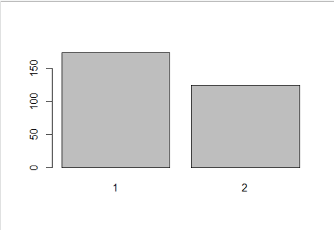
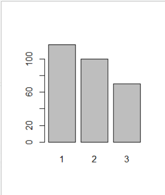
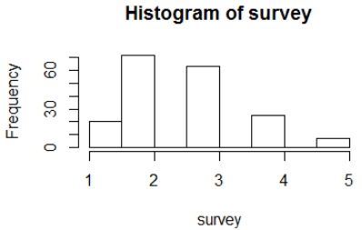
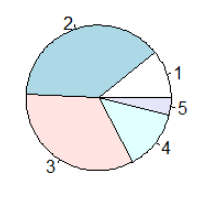
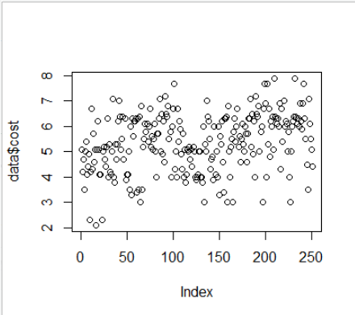
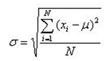
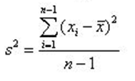
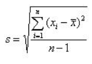
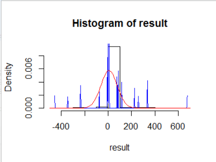

## 기술 통계량 (Descriptive Statistics)

- 자료를 요약하는 기초적인 통계량으로 데이터 분석 전에 전체적인 데이터 분포의 이해와 통계적 수치를 제공
- 모집단의 특성을 유추하는데 이용할 수 있다
- 설문조사를 시행한 논문에서는 응답자의 일반적인 특성을 반드시 제시하여야 한다.
- 논문에서는 “표분의 일반적 특성” 또는 “표본의 인구 통계적 특성”으로 표현한다.
- 인구 통계적 특성을 제시하는데 주로 이용되는 분석 : 빈도분석과 기초통계량

### 빈도 분석  (Frequence Analysis)

- 설문조자 결과에 대한 가장 기초적인 정보를 제공해주는 분석 방법으로 광범위하게 이용된다.
- 성별이나 직급을 수치화하는 명목척도나 서열척도 같은 범주형 데이터를 대상으로 비율을 측정하는데 주로 사용된다
  - 예) 전체 응답자 중에서 특정 변수값의 범주에 속한 응답자가 차지하는 비율(%)을 알아보고자 할때 주로 이용 – 특정 선거 후보가 얼마만큼의 지지율(%)을 받고 있는가? 응답자 중에서 남자의 비율(%)과 여자의 비율(%)은 ? 연령대별로 차지하는 비율(%)

### 기술 통계분석

- 빈도분석과 유사하지만 등간척도나 비율척도와 같은 연속적 데이터를 분석할 때 주로 이용한다.

  

### 척도별 기술통계량 (Descriptive Statistics) 구하기 단계

단계 1.전체 데이터셋의 분포와 특성을 분석

단계 2.측치, 이상치 등 데이터 정제

단계 3.도별 기술 통계량을 구함

### 명목척도 기술통계량

- 명목상 의미 없는 수치로 표현된 거주지역이나 성별과 같은 명목척도 변수를 대상으로 기초 통계량을 구한다.
- summary() 로 계산된 최대값, 최소값, 평균 등의 요약 통계량은 의미가 없다.
- 성별의 구성비율은 표본의 통계량으로 의미가 있다.

### 서열척도 기술 통계량 

- 계급 순위를 수치로  표현한 직급이나 학력 수준 등 *서열척도 변수*를  대상으로 기초 통계량을 구한다.
- summary() 로 계산된 최대값, 최소값, 평균 등의 요약 통계량은 의미가 없다.
- **table()** 함수에 의해서 구해진 빈도수를 통해서 표본의  통계량을 산출한다.


#### 명목척도 기술 통계량 예제

```R
> getwd()
[1] "C:/workspaceR"
> 
> data <-read.csv("./data/descriptive.csv",header=TRUE)
> 
> head(data)
  resident gender age level cost type survey pass
1        1      1  50     1  5.1    1      1    2
2        2      1  54     2  4.2    1      2    2
3       NA      1  62     2  4.7    1      1    1
4        4      2  50    NA  3.5    1      4    1
5        5      1  51     1  5.0    1      3    1
6        3      1  55     2  5.4    1      3   NA
> str(data) #변수 8개, 관측치 300개
'data.frame':	300 obs. of  8 variables:
 $ resident: int  1 2 NA 4 5 3 2 5 NA 2 ...
 $ gender  : int  1 1 1 2 1 1 2 1 1 1 ...
 $ age     : int  50 54 62 50 51 55 56 49 49 49 ...
 $ level   : int  1 2 2 NA 1 2 1 2 1 2 ...
 $ cost    : num  5.1 4.2 4.7 3.5 5 5.4 4.1 675 4.4 4.9 ...
 $ type    : int  1 1 1 1 1 1 1 NA 1 1 ...
 $ survey  : int  1 2 1 4 3 3 NA NA NA 1 ...
 $ pass    : int  2 2 1 1 1 NA 2 2 2 1 ...
> 
> #resident (거주지역)
> #gender(성별 - 명목척도 1,2)
> #level (학력수준 - 서열 1,2,3)
> #cost(생활비 비율)
> #type (학교유형 - 명목형 1,2)
> #survet(만족도 - 등간척도 1,2,3,4,5점)
> #pass (합격여부 - 명목 1,2)
>  
> dim(data)
[1] 300   8
> length(data) #변수 개수 (열개수)
[1] 8
> length(data$survey) # 관측치 ( 행개수)
[1] 300
> 
> fivenum(data)
[1] -457.2    1.0    2.0    4.7  675.0
> summary(data) # 컬럼단위로 최소 ~ 쵀대 ,평균, 1,3분위수, 결측치,중앙값(중위수) 등 제공
    resident         gender          age       
 Min.   :1.000   Min.   :0.00   Min.   :40.00  
 1st Qu.:1.000   1st Qu.:1.00   1st Qu.:48.00  
 Median :2.000   Median :1.00   Median :53.00  
 Mean   :2.233   Mean   :1.42   Mean   :53.88  
 3rd Qu.:3.000   3rd Qu.:2.00   3rd Qu.:60.00  
 Max.   :5.000   Max.   :5.00   Max.   :69.00  
 NA's   :21                                    
     level            cost               type     
 Min.   :1.000   Min.   :-457.200   Min.   :1.00  
 1st Qu.:1.000   1st Qu.:   4.425   1st Qu.:1.00  
 Median :2.000   Median :   5.400   Median :1.00  
 Mean   :1.836   Mean   :   8.752   Mean   :1.27  
 3rd Qu.:2.000   3rd Qu.:   6.300   3rd Qu.:2.00  
 Max.   :3.000   Max.   : 675.000   Max.   :2.00  
 NA's   :13      NA's   :30         NA's   :26    
     survey          pass      
 Min.   :1.00   Min.   :1.000  
 1st Qu.:2.00   1st Qu.:1.000  
 Median :3.00   Median :1.000  
 Mean   :2.61   Mean   :1.432  
 3rd Qu.:3.00   3rd Qu.:2.000  
 Max.   :5.00   Max.   :2.000  
 NA's   :113    NA's   :20     
> 
> length(data$gender) #관측치 확인
[1] 300
> summary(data$gender) #명목척도는 최소, 최대, 평균, 중위수가 의미 없음
   Min. 1st Qu.  Median    Mean 3rd Qu.    Max. 
   0.00    1.00    1.00    1.42    2.00    5.00 
> 
> table(data$gender) #각 성별의 빈도수 

  0   1   2   5 
  2 173 124   1 
> 
> data<- subset(data,data$gender==1 | data$gender==2)
> x <- table(data$gender) #빈도수에 따른 분할표    
> x

  1   2 
173 124 
> barplot(x) #범주별 데이터 시각화 -> 막대차트
> 
> prop.table(x) #비율 계산

        1         2 
0.5824916 0.4175084 
> y<-prop.table(x)
> round(y*100,2) #백분율

    1     2 
58.25 41.75 
```



#### 서열척도 기술 통계량 예제

```R
> #서열척도 기술 통계량

> #위의 subset에서 데이터가 지워졌을 수도 있을땐 다시 불러와도 된다
> data <-read.csv("./data/descriptive.csv",header=TRUE)

> summary(data$level) #서열척도는 최소, 최대, 평균, 중위수가 의미 없음
   Min. 1st Qu.  Median    Mean 3rd Qu.    Max. 
  1.000   1.000   2.000   1.836   2.000   3.000 
   NA's 
     13 
> table(data$level) #빈도수 고졸=1, 대졸=2, 대학원=3

  1   2   3 
117 100  70 

> x1<-table(data$level)
> barplot(x1)

> y1<-prop.table(x1) #비율계산
> round(y1*100,2)

    1     2     3 
40.77 34.84 24.39 
```




#### 등간척도 기술 통계량 예제

```R
> #등간척도 기술 통계량
> data <-read.csv("./data/descriptive.csv",header=TRUE)
> survey <- data$survey
> survey
  [1]  1  2  1  4  3  3 NA NA NA  1  2  2  2  2 NA NA
 [17] NA NA NA NA NA  2  2  1  2  3  3  5  2 NA NA NA
 [33] NA NA NA NA NA NA  2  2  3  4  3  2  2  3  4  5
 [49]  4  2 NA  2  3  4  3 NA NA NA NA NA NA NA  3  3
 [65]  3  3  2  2  3  3 NA NA NA  2  2  2 NA  2  2  3
 [81] NA NA  3  3  3  3  3  3  3  1  4 NA NA NA NA  4
 [97]  3  3  4 NA NA NA NA  3  3  2 NA NA  3 NA  2 NA
[113]  2  2  5  2 NA  3 NA NA NA NA NA NA NA NA NA NA
[129]  2  2  4  3  4  3  3  3 NA NA NA  2  2  2  2  2
[145]  1  2 NA NA NA NA NA  3  3  3  3  4  3 NA  4  2
[161]  2  2  2  2 NA NA NA NA  3  3  2 NA  2  3  3  3
[177] NA NA  3  4  3  4 NA NA  3  3  4  2  1  2  4  3
[193]  3  2  5  2  2  2  2  1  2  4 NA  2  2  1  1  1
[209]  2  2 NA NA NA NA NA NA NA NA NA NA  2  3  4  5
[225]  3  3  4 NA  2  1  2 NA  1  2  2  1  2  2 NA NA
[241]  3  4  5  3 NA  3  4  4  5  2  2  3 NA NA  2  1
[257]  2  1 NA NA  2  3 NA  3  4  3  4  3  4 NA NA NA
[273]  2  1  2 NA NA NA NA NA  1  1  2  2 NA NA NA NA
[289] NA  2  1  2  3  3 NA NA NA NA  3 NA
> summary(survey) #등간척도에서 평균 통계량은 어느정도 의미가 있다
   Min. 1st Qu.  Median    Mean 3rd Qu.    Max. 
   1.00    2.00    3.00    2.61    3.00    5.00 
   NA's 
    113 
> x2<-table(survey) #빈도수는 의미가 있다다
> x2
survey
 1  2  3  4  5 
20 72 63 25  7 
> hist(survey) #등간척도 시각화( 히스토그램 )
> pie(x2)
```






#### 비율척도 기술 통계량 예제

```R
> #비율척도 기술 통계량
> length(data$cost)
[1] 300
> summary(data$cost)
    Min.  1st Qu.   Median     Mean  3rd Qu. 
-457.200    4.425    5.400    8.752    6.300 
    Max.     NA's 
 675.000       30 
> #생활비가 어디에 가장 분포가 되어있나-산점도로 파악
> plot (data$cost)
> hist(survey) #등간척도 시각화( 히스토그램 )
> data <- subset(data, data$cost >=2 & data$cost<=10)
> mean(data$cost)
[1] 5.360558
> median(data$cost)
[1] 5.4
> x3<-data$cost
> median(x3)
[1] 5.4
> mean(x3)
[1] 5.360558
#평균보다 중위수가 의미를 갖는다

#평균이 극단치에 영향을 받는 경우 중위수로 대체하는 것이 낫다.
# 예)
# A반 성적 = 75,80,80,80,85 평균 = 80, 중위수 =80
# B반 성적 = 75,75,75,75,100 평균 = 80, 중위수 =75

> quantile(x3,1/4) # 1사분위수
25% 
4.6 
> quantile(x3,2/4) # 중앙값과 동일
50% 
5.4 
> quantile(x3,3/4)
75% 
6.2 
> quantile(x3,4/4)
100% 
 7.9 
```

*이상치 제거 전*


*이상치 제거 후*



#### 최빈수

```R
# 최빈수 = 빈도수가 가장 많은 변량
x3.t <-table(x3) #빈도수 
max(x3.t)

> x3.t <-table(x3) #빈도수 내 x값
> max(x3.t)
[1] 18
> x3.t
x3
2.1 2.3   3 3.3 3.4 3.5 3.8 3.9   4 4.1 4.2 4.3 4.4 
  1   2   6   2   2   5   3   3  15   9   3   5   4 
4.5 4.6 4.7 4.8 4.9   5 5.1 5.2 5.3 5.4 5.5 5.6 5.7 
  1   5   6   2   4  18  11   9   7   5   9   4   6 
5.8 5.9   6 6.1 6.2 6.3 6.4 6.5 6.7 6.8 6.9   7 7.1 
  5   2  14   8  13  16  11   4   8   4   4   3   4 
7.2 7.7 7.9 
  2   4   2 
> #x3.t 를 데이터프레임으로 변환해보기
> x3.m<-rbind(x3.t)
> x3.m
     2.1 2.3 3 3.3 3.4 3.5 3.8 3.9  4 4.1 4.2 4.3
x3.t   1   2 6   2   2   5   3   3 15   9   3   5
     4.4 4.5 4.6 4.7 4.8 4.9  5 5.1 5.2 5.3 5.4 5.5
x3.t   4   1   5   6   2   4 18  11   9   7   5   9
     5.6 5.7 5.8 5.9  6 6.1 6.2 6.3 6.4 6.5 6.7 6.8
x3.t   4   6   5   2 14   8  13  16  11   4   8   4
     6.9 7 7.1 7.2 7.7 7.9
x3.t   4 3   4   2   4   2
> class(x3.m)
[1] "matrix"
> str(x3.m)
 int [1, 1:42] 1 2 6 2 2 5 3 3 15 9 ...
 - attr(*, "dimnames")=List of 2
  ..$ : chr "x3.t"
  ..$ : chr [1:42] "2.1" "2.3" "3" "3.3" ...
> x3.df <-as.data.frame(x3.m)
> which(x3.df[1,]==18)
[1] 19
> x3.df[1,19]
[1] 18
> names(x3.df[1,19])
NULL
> names(x3.df[19])
[1] "5"
```

### 산포도


**분산**

**표준편차**

N : 모집단 크기 , u(뮤) : 모평균


**표본분산**

**표본 표준편차**


**표준오차**

б : 표준편차 , n: 표본의크기


#### 비율척도의 빈도 분석 : 비율척도를 범주회 (리코딩)

```R
> #비율척도의 빈도 분석 : 비율척도를 범주회 (리코딩) 
> table(data$cost)

2.1 2.3   3 3.3 3.4 3.5 3.8 3.9   4 4.1 4.2 4.3 4.4 
  1   2   6   2   2   5   3   3  15   9   3   5   4 
4.5 4.6 4.7 4.8 4.9   5 5.1 5.2 5.3 5.4 5.5 5.6 5.7 
  1   5   6   2   4  18  11   9   7   5   9   4   6 
5.8 5.9   6 6.1 6.2 6.3 6.4 6.5 6.7 6.8 6.9   7 7.1 
  5   2  14   8  13  16  11   4   8   4   4   3   4 
7.2 7.7 7.9 
  2   4   2 
> hist(data$cost)
> plot(data$cost)
> 
> 
> data$cost2[data$cost >=1 & data$cost<=3] <-1
>            data$cost2[data$cost >=4 & data$cost<=6] <-2
>                       data$cost2[data$cost >=7]  <-3
> table(data$cost2)

  1   2   3 
  9 144  15 
> barplot(table(data$cost2))           
> pie(table(data$cost2))

```


### skewness(), kurtosis()

> 비대칭도 구하기

- 비대칭도는 데이터의 분포가 정규분포를 갖는지를 알기 위해서 이용하며, 왜도와 첨도의 통계량을 사용한다

```R
> library(moments)
> skewness(데이터) # 왜도반환 0보다 크면,
Error in skewness(데이터) : object '데이터' not found
> kurtosis(첨도 변환)
Error: unexpected symbol in "kurtosis(첨도 변환"
> cost<-data$cost
> result <- cost[!is.na(cost)]
> result
  [1]    5.1    4.2    4.7    3.5    5.0    5.4
  [7]    4.1  675.0    4.4    4.9    2.3    4.2
 [13]    6.7    4.3  257.8    5.7    4.6    5.1
 [19]    2.1    5.1    6.2    5.1    4.1    4.1
 [25]  -75.0    2.3    5.0    5.2    4.7    4.4
 [31]    5.2    6.3    4.0    5.3    4.2    4.1
 [37]    5.0    7.1    4.0   85.1    3.8    5.3
 [43]    4.7    5.3    6.2    7.0    6.4    5.1
 [49]    5.5    6.4    4.7    6.3    3.9    4.1
 [55]    4.1    5.0    3.5    6.0    3.3 -457.2
 [61]    6.3    5.6    6.2    6.2    6.3   -5.9
 [67]    3.4    6.3    3.5    6.4    3.0    6.8
 [73]    3.5    5.2    5.5    6.1    5.8    6.1
 [79]    5.4    6.0    6.7    5.2    5.6    5.1
 [85]    5.5    6.1    5.0    4.0    5.7  115.7
 [91]   75.1    5.7    6.3    7.1    5.0    6.5
 [97]    4.9    6.2    4.6    7.2    6.5    6.4
[103]    6.8    5.5    5.8    4.0    6.0    6.7
[109]    7.7    4.3    5.0    4.0    6.7    5.4
[115]  336.5    6.2    5.9    4.9    4.3  225.8
[121]    5.7    4.0    5.1    3.8    4.1   -4.8
[127]    5.1    5.0    5.2    4.7    5.1    4.4
[133]    5.2    5.0    4.0    3.9    4.0    4.1
[139]    5.0    5.0    4.0    4.0   85.1    3.8
[145]    6.0    3.0    5.3    5.0    7.0    6.4
[151]    6.2    5.5    4.3    4.7    4.8    3.9
[157]    6.0    4.1    5.0    4.0    6.0    3.3
[163] -345.6    5.6    5.3    6.2    4.6   -5.9
[169]    3.4    6.3    6.3    6.4    3.0    6.8
[175]    5.0    4.0    5.2    5.5    3.0    5.8
[181]    6.3    5.4    6.0    6.7    5.2    5.6
[187]    4.6    5.5    6.1    5.3    5.0    6.0
[193]    5.7  115.7    4.6   75.1    5.7    6.3
[199]    6.3    7.1    5.2    6.5    4.9    6.2
[205]    4.0    7.2    6.5    6.4    6.8    5.0
[211]    5.8    6.0    3.0    6.7    7.7    6.9
[217]    4.0    7.7    5.3    6.7    4.8    6.2
[223]    6.0    6.4 -235.8    5.1    7.9    6.4
[229]    6.3    6.1    6.3    6.0    6.9    4.3
[235]    6.7    5.4    7.0    6.0    6.2    6.1
[241]    5.0    5.8    4.0    3.0    5.0    6.0
[247]    6.2    6.4 -235.8    7.9    6.4    6.3
[253]    6.1    6.3    6.0    6.9  336.5    6.2
[259]    5.9    6.9    7.7    6.3    5.5    4.5
[265]    3.5    7.1    6.1    5.5    5.1    4.4
> skewness(cost)
[1] NA
> kurtosis(cost)
[1] NA
> hist(result)
> hist(result,freq=F)
> lines(density(result),col='blue')
> x<-seq(0,8,1)
> curve(dnorm(x,mean(result),sd(result)),col='red',add=T)
```




### detach(), attach()

- 리스트객체 $key, dataframe객체$컬럼변수
- attach()함수는 dataframe객체$컬럼변수로부터 dataframe 객체 데이터셋
- detach()함수는 dataframe객체$컬럼변수로 관측치에 접근

```R
> data <-read.csv("./data/descriptive.csv",header=TRUE)
> data$survey
  [1]  1  2  1  4  3  3 NA NA NA  1  2  2  2  2 NA NA
 [17] NA NA NA NA NA  2  2  1  2  3  3  5  2 NA NA NA
 [33] NA NA NA NA NA NA  2  2  3  4  3  2  2  3  4  5
 [49]  4  2 NA  2  3  4  3 NA NA NA NA NA NA NA  3  3
 [65]  3  3  2  2  3  3 NA NA NA  2  2  2 NA  2  2  3
 [81] NA NA  3  3  3  3  3  3  3  1  4 NA NA NA NA  4
 [97]  3  3  4 NA NA NA NA  3  3  2 NA NA  3 NA  2 NA
[113]  2  2  5  2 NA  3 NA NA NA NA NA NA NA NA NA NA
[129]  2  2  4  3  4  3  3  3 NA NA NA  2  2  2  2  2
[145]  1  2 NA NA NA NA NA  3  3  3  3  4  3 NA  4  2
[161]  2  2  2  2 NA NA NA NA  3  3  2 NA  2  3  3  3
[177] NA NA  3  4  3  4 NA NA  3  3  4  2  1  2  4  3
[193]  3  2  5  2  2  2  2  1  2  4 NA  2  2  1  1  1
[209]  2  2 NA NA NA NA NA NA NA NA NA NA  2  3  4  5
[225]  3  3  4 NA  2  1  2 NA  1  2  2  1  2  2 NA NA
[241]  3  4  5  3 NA  3  4  4  5  2  2  3 NA NA  2  1
[257]  2  1 NA NA  2  3 NA  3  4  3  4  3  4 NA NA NA
[273]  2  1  2 NA NA NA NA NA  1  1  2  2 NA NA NA NA
[289] NA  2  1  2  3  3 NA NA NA NA  3 NA
> data$cost
  [1]    5.1    4.2    4.7    3.5    5.0    5.4
  [7]    4.1  675.0    4.4    4.9    2.3    4.2
 [13]    6.7    4.3  257.8    5.7    4.6    5.1
 [19]    2.1    5.1    6.2    5.1    4.1    4.1
 [25]  -75.0    2.3    5.0     NA    5.2    4.7
 [31]     NA    4.4    5.2     NA    6.3    4.0
 [37]    5.3     NA    4.2    4.1    5.0     NA
 [43]    7.1    4.0   85.1    3.8    5.3    4.7
 [49]    5.3    6.2    7.0    6.4    5.1    5.5
 [55]    6.4    4.7    6.3    3.9    4.1    4.1
 [61]    5.0    3.5    6.0    3.3 -457.2    6.3
 [67]    5.6    6.2    6.2    6.3   -5.9    3.4
 [73]    6.3    3.5    6.4    3.0    6.8     NA
 [79]    3.5    5.2    5.5    6.1    5.8    6.1
 [85]    5.4    6.0    6.7    5.2    5.6    5.1
 [91]    5.5    6.1     NA    5.0    4.0    5.7
 [97]  115.7     NA   75.1    5.7    6.3     NA
[103]    7.1    5.0    6.5     NA    4.9    6.2
[109]    4.6    7.2    6.5    6.4    6.8    5.5
[115]    5.8    4.0    6.0    6.7    7.7    4.3
[121]    5.0    4.0    6.7    5.4     NA  336.5
[127]    6.2    5.9    4.9    4.3  225.8    5.7
[133]    4.0    5.1    3.8    4.1   -4.8    5.1
[139]    5.0     NA    5.2    4.7    5.1    4.4
[145]    5.2     NA    5.0    4.0    3.9     NA
[151]    4.0    4.1    5.0    5.0    4.0    4.0
[157]   85.1    3.8    6.0    3.0    5.3    5.0
[163]    7.0    6.4    6.2    5.5    4.3    4.7
[169]    4.8    3.9    6.0    4.1    5.0    4.0
[175]    6.0    3.3 -345.6     NA    5.6    5.3
[181]    6.2    4.6   -5.9    3.4    6.3    6.3
[187]    6.4    3.0    6.8    5.0    4.0    5.2
[193]    5.5    3.0    5.8    6.3    5.4    6.0
[199]    6.7    5.2    5.6    4.6    5.5    6.1
[205]    5.3    5.0    6.0    5.7  115.7    4.6
[211]   75.1    5.7    6.3    6.3    7.1    5.2
[217]    6.5     NA    4.9    6.2    4.0    7.2
[223]    6.5    6.4    6.8    5.0    5.8    6.0
[229]    3.0    6.7    7.7     NA    6.9    4.0
[235]    7.7    5.3    6.7    4.8    6.2    6.0
[241]    6.4 -235.8    5.1    7.9    6.4    6.3
[247]    6.1     NA    6.3     NA    6.0    6.9
[253]     NA    4.3     NA     NA    6.7    5.4
[259]     NA    7.0    6.0    6.2    6.1    5.0
[265]    5.8    4.0    3.0    5.0    6.0    6.2
[271]     NA    6.4 -235.8     NA    7.9    6.4
[277]    6.3    6.1     NA    6.3     NA    6.0
[283]    6.9     NA  336.5    6.2    5.9     NA
[289]    6.9     NA    7.7    6.3    5.5    4.5
[295]    3.5    7.1    6.1    5.5    5.1    4.4
> attach(data) #데이터셋 '$' 생략할 수 있도록 설정
The following objects are masked _by_ .GlobalEnv:

    cost, pass, survey

> length(cost)   #na.rm=T옵션
[1] 251
> summary(cost)
   Min. 1st Qu.  Median    Mean 3rd Qu.    Max. 
  2.100   4.600   5.400   5.361   6.200   7.900 
> mean(cost,na.rm=T)
[1] 5.360558
> min(cost,na.rm=T)
[1] 2.1
> range(cost,na.rm=T)
[1] 2.1 7.9
> sort(cost,decreasing=T)
  [1] 7.9 7.9 7.7 7.7 7.7 7.7 7.2 7.2 7.1 7.1 7.1 7.1
 [13] 7.0 7.0 7.0 6.9 6.9 6.9 6.9 6.8 6.8 6.8 6.8 6.7
 [25] 6.7 6.7 6.7 6.7 6.7 6.7 6.7 6.5 6.5 6.5 6.5 6.4
 [37] 6.4 6.4 6.4 6.4 6.4 6.4 6.4 6.4 6.4 6.4 6.3 6.3
 [49] 6.3 6.3 6.3 6.3 6.3 6.3 6.3 6.3 6.3 6.3 6.3 6.3
 [61] 6.3 6.3 6.2 6.2 6.2 6.2 6.2 6.2 6.2 6.2 6.2 6.2
 [73] 6.2 6.2 6.2 6.1 6.1 6.1 6.1 6.1 6.1 6.1 6.1 6.0
 [85] 6.0 6.0 6.0 6.0 6.0 6.0 6.0 6.0 6.0 6.0 6.0 6.0
 [97] 6.0 5.9 5.9 5.8 5.8 5.8 5.8 5.8 5.7 5.7 5.7 5.7
[109] 5.7 5.7 5.6 5.6 5.6 5.6 5.5 5.5 5.5 5.5 5.5 5.5
[121] 5.5 5.5 5.5 5.4 5.4 5.4 5.4 5.4 5.3 5.3 5.3 5.3
[133] 5.3 5.3 5.3 5.2 5.2 5.2 5.2 5.2 5.2 5.2 5.2 5.2
[145] 5.1 5.1 5.1 5.1 5.1 5.1 5.1 5.1 5.1 5.1 5.1 5.0
[157] 5.0 5.0 5.0 5.0 5.0 5.0 5.0 5.0 5.0 5.0 5.0 5.0
[169] 5.0 5.0 5.0 5.0 5.0 4.9 4.9 4.9 4.9 4.8 4.8 4.7
[181] 4.7 4.7 4.7 4.7 4.7 4.6 4.6 4.6 4.6 4.6 4.5 4.4
[193] 4.4 4.4 4.4 4.3 4.3 4.3 4.3 4.3 4.2 4.2 4.2 4.1
[205] 4.1 4.1 4.1 4.1 4.1 4.1 4.1 4.1 4.0 4.0 4.0 4.0
[217] 4.0 4.0 4.0 4.0 4.0 4.0 4.0 4.0 4.0 4.0 4.0 3.9
[229] 3.9 3.9 3.8 3.8 3.8 3.5 3.5 3.5 3.5 3.5 3.4 3.4
[241] 3.3 3.3 3.0 3.0 3.0 3.0 3.0 3.0 2.3 2.3 2.1
> detach(data) # 데이터셋 '$' 생략할 수 없도록 설정, attach() 해제
> length(pass) # 오류 발생
[1] 7
> length(data$pass)
[1] 300
```


### Hmisc 패키지 이용 기술 통계량 구하기

- 전체 데이터 셋에 포함된 모든 변수를  대상으로 기술 통계량 제공하며, 빈도와 비율 데이터를 일괄적으로 제공해준다.

  - describe() : 변수의 척도에 따라서 서로 다르게 통계량을 제공한다 명목, 서열, 등간척도는 빈도수, 비율 등을 제공하며, 비율척도는 mean, lowest, hightest등의 통계량을 제공해준다.

  ```R
  > summary(Hmisc)
  > describe(data)
  data 
  
   8  Variables      300  Observations
  -----------------------------------------------------
  resident 
         n  missing distinct     Info     Mean 
       279       21        5    0.881    2.233 
       Gmd 
     1.553 
                                          
  Value          1     2     3     4     5
  Frequency    132    55    31    17    44
  Proportion 0.473 0.197 0.111 0.061 0.158
  -----------------------------------------------------
  gender 
         n  missing distinct     Info     Mean 
       300        0        4    0.738     1.42 
       Gmd 
     0.521 
                                    
  Value          0     1     2     5
  Frequency      2   173   124     1
  Proportion 0.007 0.577 0.413 0.003
  -----------------------------------------------------
  age 
         n  missing distinct     Info     Mean 
       300        0       26    0.995    53.88 
       Gmd      .05      .10      .25      .50 
     7.735       45       46       48       53 
       .75      .90      .95 
        60       64       65 
  
  lowest : 40 42 44 45 46, highest: 63 64 65 68 69
  -----------------------------------------------------
  level 
         n  missing distinct     Info     Mean 
       287       13        3    0.875    1.836 
       Gmd 
    0.8548 
                              
  Value          1     2     3
  Frequency    117   100    70
  Proportion 0.408 0.348 0.244
  -----------------------------------------------------
  cost 
         n  missing distinct     Info     Mean 
       270       30       55    0.999    8.751 
       Gmd      .05      .10      .25      .50 
      28.3    3.000    3.800    4.425    5.400 
       .75      .90      .95 
     6.300    6.900    7.700 
  
  -458 (1, 0.004), -346 (1, 0.004), -236 (2, 0.007),
  -74 (1, 0.004), -6 (2, 0.007), -4 (1, 0.004), 2 (9,
  0.033), 4 (69, 0.256), 6 (161, 0.596), 8 (12,
  0.044), 76 (2, 0.007), 86 (2, 0.007), 116 (2,
  0.007), 226 (1, 0.004), 258 (1, 0.004), 336 (2,
  0.007), 674 (1, 0.004)
  -----------------------------------------------------
  type 
         n  missing distinct     Info     Mean 
       274       26        2    0.591     1.27 
       Gmd 
    0.3957 
                      
  Value         1    2
  Frequency   200   74
  Proportion 0.73 0.27
  -----------------------------------------------------
  survey 
         n  missing distinct     Info     Mean 
       187      113        5    0.901     2.61 
       Gmd 
     1.052 
                                          
  Value          1     2     3     4     5
  Frequency     20    72    63    25     7
  Proportion 0.107 0.385 0.337 0.134 0.037
  -----------------------------------------------------
  pass 
         n  missing distinct     Info     Mean 
       280       20        2    0.736    1.432 
       Gmd 
    0.4925 
                        
  Value          1     2
  Frequency    159   121
  Proportion 0.568 0.432
  ```

  

### prettyR 패키지 이용 기술 통계량 구하기

- freq() :  Hmisc 패키지의 describe() 와 유사한 기능을 제공
- 변수별 빈도수, 결측치, 비율을 제공하며, 비율은 소주점까지 제공하며, freq() 함수는 각 명목척도의 변수를 대상으로 NA 비율까지 제공한다.

```R
> ############prettyR 패키지
> install.packages("prettyR")
> library(prettyR)
> freq(data)

Frequencies for resident 
        1    2    5    3    4   NA
      132   55   44   31   17   21
%      44 18.3 14.7 10.3  5.7    7 
%!NA 47.3 19.7 15.8 11.1  6.1 


Frequencies for gender 
        1    2    0    5   NA
      173  124    2    1    0
%    57.7 41.3  0.7  0.3    0 
%!NA 57.7 41.3  0.7  0.3 


Frequencies for age 
       48   49   47   65   55   45   63   51   54   46   58   60   64   50   56   57   61   59   52   62   53   69   40   42   44   68   NA
       34   30   24   24   23   19   18   13   13   12   11   10   10    9    9    9    8    6    4    4    3    3    1    1    1    1    0
%    11.3   10    8    8  7.7  6.3    6  4.3  4.3    4  3.7  3.3  3.3    3    3    3  2.7    2  1.3  1.3    1    1  0.3  0.3  0.3  0.3    0 
%!NA 11.3   10    8    8  7.7  6.3    6  4.3  4.3    4  3.7  3.3  3.3    3    3    3  2.7    2  1.3  1.3    1    1  0.3  0.3  0.3  0.3 


Frequencies for level 
        1    2    3   NA
      117  100   70   13
%      39 33.3 23.3  4.3 
%!NA 40.8 34.8 24.4 


Frequencies for cost 
          5    6.3      4      6    6.2    5.1    6.4    4.1    5.2    5.5    6.1    6.7    5.3      3    4.7    5.7    3.5    4.3    4.6    5.4    5.8    4.4    4.9    5.6    6.5    6.8    6.9    7.1    7.7    3.8    3.9    4.2      7 -235.8   -5.9    2.3    3.3    3.4    4.8    5.9    7.2    7.9   75.1   85.1  115.7  336.5 -457.2 -345.6    -75   -4.8    2.1    4.5  225.8  257.8    675     NA
       18   16   15   14   13   11   11    9    9    9    8    8    7    6    6    6    5    5    5    5    5    4    4    4    4    4    4    4    4    3    3    3    3    2    2    2    2    2    2    2    2    2    2    2    2    2    1    1    1    1    1    1    1    1    1   30
%       6  5.3    5  4.7  4.3  3.7  3.7    3    3    3  2.7  2.7  2.3    2    2    2  1.7  1.7  1.7  1.7  1.7  1.3  1.3  1.3  1.3  1.3  1.3  1.3  1.3    1    1    1    1  0.7  0.7  0.7  0.7  0.7  0.7  0.7  0.7  0.7  0.7  0.7  0.7  0.7  0.3  0.3  0.3  0.3  0.3  0.3  0.3  0.3  0.3   10 
%!NA  6.7  5.9  5.6  5.2  4.8  4.1  4.1  3.3  3.3  3.3    3    3  2.6  2.2  2.2  2.2  1.9  1.9  1.9  1.9  1.9  1.5  1.5  1.5  1.5  1.5  1.5  1.5  1.5  1.1  1.1  1.1  1.1  0.7  0.7  0.7  0.7  0.7  0.7  0.7  0.7  0.7  0.7  0.7  0.7  0.7  0.4  0.4  0.4  0.4  0.4  0.4  0.4  0.4  0.4 


Frequencies for type 
        1    2   NA
      200   74   26
%    66.7 24.7  8.7 
%!NA   73   27 


Frequencies for survey 
        2    3    4    1    5   NA
       72   63   25   20    7  113
%      24   21  8.3  6.7  2.3 37.7 
%!NA 38.5 33.7 13.4 10.7  3.7 


Frequencies for pass 
        1    2   NA
      159  121   20
%      53 40.3  6.7 
%!NA 56.8 43.2 
```

### Sampling

#### 단순 임의 추출

- Sampling은 훈련 데이터Training Data와 테스트 데이터Test Data의 분리에서도 중요

- 전체 데이터 중 80%를 훈련 데이터, 20%를 테스트 데이터로 분리한 뒤 데이터에 대한 모델링은 훈련 데이터로만 수행하고, 모델의 성능은 테스트 데이터로 평가하면 모델의 성능을 가장 적절히 평가할 수 있다. 

- 과적합

  - 데이터를 분리하지 않고 전체 데이터를 모델링과 모델 평가에 사용하게 되면 데이터에 내재하는 실제적 특징. Signal 외에 데이터에 우연히 포함된 노이즈 Noise 까지 반영한 모델을 만들게 될 위험이 있다. 과적합된 모델은 예측력이 떨어지므로 반드시 **경계**해야 할 대상이다

- 표본을 추출하는 방법

  - 단순 임의 추출 

    ```R
    > install.packages("sampling")
    > library(sampling)
    
    > head(iris)
      Sepal.Length Sepal.Width Petal.Length Petal.Width
    1          5.1         3.5          1.4         0.2
    2          4.9         3.0          1.4         0.2
    3          4.7         3.2          1.3         0.2
    4          4.6         3.1          1.5         0.2
    5          5.0         3.6          1.4         0.2
    6          5.4         3.9          1.7         0.4
      Species
    1  setosa
    2  setosa
    3  setosa
    4  setosa
    5  setosa
    6  setosa
    ```

#### 층화 임의 추출

```R
> result <- strata(c("Species"), size=c(3,3,3) , method="srswor", data=iris)
> result
       Species ID_unit Prob Stratum
9       setosa       9 0.06       1
33      setosa      33 0.06       1
38      setosa      38 0.06       1
56  versicolor      56 0.06       2
81  versicolor      81 0.06       2
85  versicolor      85 0.06       2
118  virginica     118 0.06       3
121  virginica     121 0.06       3
125  virginica     125 0.06       3

> getdata(iris, result)
    Sepal.Length Sepal.Width Petal.Length
9            4.4         2.9          1.4
33           5.2         4.1          1.5
38           4.9         3.6          1.4
56           5.7         2.8          4.5
81           5.5         2.4          3.8
85           5.4         3.0          4.5
118          7.7         3.8          6.7
121          6.9         3.2          5.7
125          6.7         3.3          5.7
    Petal.Width    Species ID_unit Prob Stratum
9           0.2     setosa       9 0.06       1
33          0.1     setosa      33 0.06       1
38          0.1     setosa      38 0.06       1
56          1.3 versicolor      56 0.06       2
81          1.1 versicolor      81 0.06       2
85          1.5 versicolor      85 0.06       2
118         2.2  virginica     118 0.06       3
121         2.3  virginica     121 0.06       3
125         2.1  virginica     125 0.06       3
```


#### 계통 추출

```R
> #계통추출 
> install.packages("doBy")
> library(doBy)
> x <- data.frame(x=1:10)
> sampleBy(~1, frac=.3, data=x, systematic=TRUE)
  [,1] [,2] [,3]
1    1    4    7

> d <- data.frame(x=c("1", "2", "2", "1"),  y=c("A", "B", "A", "B"),   num=c(3, 5, 8, 7))
> xt <- xtabs(num ~ x + y, data=d)   #분할표 생성
> xt
   y
x   A B
  1 3 7
  2 8 5

> margin.table(xt, 1)  # 3 + 7 = 10, 8 + 5 = 13
x
 1  2 
10 13 

> margin.table(xt, 2)  # 3 + 8 = 11, 7 + 5 = 12
y
 A  B 
11 12 

> margin.table(xt)     # 3 + 7 + 8 + 5 = 23
[1] 23

> prop.table(xt, 1)  #  3/10, 7/10
   y
x           A         B
  1 0.3000000 0.7000000
  2 0.6153846 0.3846154

> prop.table(xt, 2)  #  3/11, 7/12
   y
x           A         B
  1 0.2727273 0.5833333
  2 0.7272727 0.4166667

> prop.table(xt)     #  3/23, 7/23
   y
x           A         B
  1 0.1304348 0.3043478
  2 0.3478261 0.2173913
```


## 교차분석 & 카이제곱검정

### 교차 분석

>  범주형 자료(명목척도 또는 서열척도)를 대상으로 <u>두개 이상의 변수들에 대한 관련성</u>을 알아보기 위해서 결합분포를 나타내는 <u>교차 분할표</u>를 작성하고 이를 통해서 <u>변수 상호 간의 관련성 여부를 분석</u>하는 방법

- 빈도분석의 <u>특성별 차이</u>를 분석하기 위해 수행하는 분석방법으로 빈도분석결과에 대한 보충자료를 제시하는데 효과적
- 교차분석은 빈도분석과 함께 고급통계 분석의 기초 정보를 제공한다.

#### 교차분석 고려사항

- 교차분석에 사용되는 변수는 값이 **10 미만**인 <u>범주형 변수(명목 척도, 서열 척도)</u>이어야 한다.
- 비율척도인 경우는 코딩변경(리코딩)을 통해서 범주형 자료로 변화해야 한다.
  
  - 예) 연령대 10~19세는 1, 20~29세는 2, 30~39세는 3등으로 범주화하여 변경한다.
- 교차 분할표를 작성하기 위해서는 연구 환경에서 해당 변수를 확인(독립 변수와 종속변수)하여 모델링한 후 <u>범주형 데이터로 변환</u>하는 리코딩 과정을 거친 후에 대상 변수를 <u>데이터 프레임으로 생성</u>한다.
- 변수 모델
  
- 특정 객체를 대상으로 분석할 속성(변수)을 선택하여 <u>속성 간의 관계를 설정</u>하는 일련의 과정 
  
- gmodels 패키지 

- **CrossTable()** : 교차 분할표 생성,  **‘chisq=TRUE’** 속성을 적용하면 **카이제곱검정 결과**를 볼수 있다.
   교차분할표의 첫번째 줄은 **관측치**, 두번째 줄은 **카이제곱의 결과(기대치 비율)**, 세번째 줄은 **현재 행의 비율**, 네번째는 **현재 열의 비율**, 마지막 줄은 전체 비율에서 **현재 셀의 값이 차지하는 비율**

- 교차 분할표에서 기대비율은 카이 제곱에 의해서 구해진 결과이다.

  

- 카이제곱식에서 기대값은 **(현재 셀의 행 합 X 현재 셀의 열 합) / 전체합**

  ```R
  > data <- read.csv("./data/cleanDescriptive.csv", header=TRUE)
  > data
     resident gender age level cost type survey pass
  1         1      1  50     1  5.1    1      1    2
  2         2      1  54     2  4.2    1      2    2
  3        NA      1  62     2  4.7    1      1    1
  4         4      2  50    NA  3.5    1      4    1
  5         5      1  51     1  5.0    1      3    1
  6         3      1  55     2  5.4    1      3   NA
  7         2      2  56     1  4.1    1     NA    2
  8        NA      1  49     1  4.4    1     NA    2
  9         2      1  49     2  4.9    1      1    1
  10        5      2  49    NA  2.3    1      2    1
  11        3      1  52     1  4.2    1      2    2
  12        1      1  57     1  6.7    1      2    1
  13        2      2  51     3  4.3    1      2    1
  14        1      1  63     1  5.7    1     NA    2
  15        3      1  55     2  4.6    2     NA    2
  ..생략 
  71
     cost2 resident2 gender2   age2   level2 pass2
  1      2    특별시    남자 장년층     고졸  실패
  2      2    광역시    남자 장년층     대졸  실패
  3      2      <NA>    남자 노년층     대졸  합격
  4     NA    광역시    여자 장년층     <NA>  합격
  5      2    시구군    남자 장년층     고졸  합격
  6      2    광역시    남자 장년층     대졸  <NA>
  7      2    광역시    여자 장년층     고졸  실패
  8      2      <NA>    남자 장년층     고졸  실패
  9      2    광역시    남자 장년층     대졸  합격
  10     1    시구군    여자 장년층     <NA>  합격
  11     2    광역시    남자 장년층     고졸  실패
  12    NA    특별시    남자 장년층     고졸  합격
  13     2    광역시    여자 장년층 대학원졸  합격
  14     2    특별시    남자 노년층     고졸  실패
  15     2    광역시    남자 장년층     대졸  실패
  ..생략 
  71
   [ reached 'max' / getOption("max.print") -- omitted 177 rows ]
  
  > str(data)
  'data.frame':	248 obs. of  14 variables:
   $ resident : int  1 2 NA 4 5 3 2 NA 2 5 ...
   $ gender   : int  1 1 1 2 1 1 2 1 1 2 ...
   $ age      : int  50 54 62 50 51 55 56 49 49 49 ...
   $ level    : int  1 2 2 NA 1 2 1 1 2 NA ...
   $ cost     : num  5.1 4.2 4.7 3.5 5 5.4 4.1 4.4 4.9 2.3 ...
   $ type     : int  1 1 1 1 1 1 1 1 1 1 ...
   $ survey   : int  1 2 1 4 3 3 NA NA 1 2 ...
   $ pass     : int  2 2 1 1 1 NA 2 2 1 1 ...
   $ cost2    : int  2 2 2 NA 2 2 2 2 2 1 ...
   $ resident2: Factor w/ 3 levels "광역시","시구군",..: 3 1 NA 1 2 1 1 NA 1 2 ...
   $ gender2  : Factor w/ 2 levels "남자","여자": 1 1 1 2 1 1 2 1 1 2 ...
   $ age2     : Factor w/ 3 levels "노년층","장년층",..: 2 2 1 2 2 2 2 2 2 2 ...
   $ level2   : Factor w/ 3 levels "고졸","대졸",..: 1 2 2 NA 1 2 1 1 2 NA ...
   $ pass2    : Factor w/ 2 levels "실패","합격": 1 1 2 2 2 NA 1 1 2 2 ...
  
  > #부모의 학력수준이 자녀의 대학진학 여부와 관련이 있는지를 분석하기 위해
  > # 학력수준 변수는 독립변수
  > # 대학진학 여부 변수는 종속변수
  
  > x<- data$level2  
  > y<- data$pass2
  > result <- data.frame(Level=x, Pass=y)
  > dim(result)
  [1] 248   2
  
  > #교차분석을 위한 분할표 생성
  > table(result)
            Pass
  Level      실패 합격
    고졸       40   49
    대졸       27   55
    대학원졸   23   31
  
  > install.packages("gmodels")
  > library(gmodels)
  > library(ggplot2)
  > CrossTable(x=result$Level, y=result$Pass)
  
   
     Cell Contents
  |-------------------------|
  |                       N |
  | Chi-square contribution |
  |           N / Row Total |
  |           N / Col Total |
  |         N / Table Total |
  |-------------------------|
  
   
  Total Observations in Table:  225 
  
   
               | result$Pass 
  result$Level |      실패 |      합격 | Row Total | 
  -------------|-----------|-----------|-----------|
          고졸 |        40 |        49 |        89 | 
               |     0.544 |     0.363 |           | 
               |     0.449 |     0.551 |     0.396 | 
               |     0.444 |     0.363 |           | 
               |     0.178 |     0.218 |           | 
  -------------|-----------|-----------|-----------|
          대졸 |        27 |        55 |        82 | 
               |     1.026 |     0.684 |           | 
               |     0.329 |     0.671 |     0.364 | 
               |     0.300 |     0.407 |           | 
               |     0.120 |     0.244 |           | 
  -------------|-----------|-----------|-----------|
      대학원졸 |        23 |        31 |        54 | 
               |     0.091 |     0.060 |           | 
               |     0.426 |     0.574 |     0.240 | 
               |     0.256 |     0.230 |           | 
               |     0.102 |     0.138 |           | 
  -------------|-----------|-----------|-----------|
  Column Total |        90 |       135 |       225 | 
               |     0.400 |     0.600 |           | 
  -------------|-----------|-----------|-----------|
  
   
  > head(diamonds)
  # A tibble: 6 x 10
    carat cut   color clarity depth table price     x
    <dbl> <ord> <ord> <ord>   <dbl> <dbl> <int> <dbl>
  1 0.23  Ideal E     SI2      61.5    55   326  3.95
  2 0.21  Prem~ E     SI1      59.8    61   326  3.89
  3 0.23  Good  E     VS1      56.9    65   327  4.05
  4 0.290 Prem~ I     VS2      62.4    58   334  4.2 
  5 0.31  Good  J     SI2      63.3    58   335  4.34
  6 0.24  Very~ J     VVS2     62.8    57   336  3.94
  # ... with 2 more variables: y <dbl>, z <dbl>
  > str(diamonds)  
  Classes ‘tbl_df’, ‘tbl’ and 'data.frame':	53940 obs. of  10 variables:
   $ carat  : num  0.23 0.21 0.23 0.29 0.31 0.24 0.24 0.26 0.22 0.23 ...
   $ cut    : Ord.factor w/ 5 levels "Fair"<"Good"<..: 5 4 2 4 2 3 3 3 1 3 ...
   $ color  : Ord.factor w/ 7 levels "D"<"E"<"F"<"G"<..: 2 2 2 6 7 7 6 5 2 5 ...
   $ clarity: Ord.factor w/ 8 levels "I1"<"SI2"<"SI1"<..: 2 3 5 4 2 6 7 3 4 5 ...
   $ depth  : num  61.5 59.8 56.9 62.4 63.3 62.8 62.3 61.9 65.1 59.4 ...
   $ table  : num  55 61 65 58 58 57 57 55 61 61 ...
   $ price  : int  326 326 327 334 335 336 336 337 337 338 ...
   $ x      : num  3.95 3.89 4.05 4.2 4.34 3.94 3.95 4.07 3.87 4 ...
   $ y      : num  3.98 3.84 4.07 4.23 4.35 3.96 3.98 4.11 3.78 4.05 ...
   $ z      : num  2.43 2.31 2.31 2.63 2.75 2.48 2.47 2.53 2.49 2.39 ...
  ```


### 카이제곱검정

#### 카이제곱 검정(chi-square test) 절차와 기본가정

단계1 ] 가설을 설정한다.
           귀무가설 H0  : ~ 같다, ~ 다르지 않다, ~ 차이가 없다, ~ 효과가 없다.
           대립가설 H1 :  ~같지 않다, ~다르다 , ~ 차이가 있다, ~ 효과가 있다

단계2 ] 유의수준(α)을 결정한다
              일반 사회과학 분야 : α=0.05,  의.생명과학 분야 : α =0.01

단계3 ] <u>자유도(df)</u>와 유의수준(α)에 따른  X2(제곱) 분포표에 의한 기각값 결정한다.

단계4 ] 관찰도수에 대한 기대도수를 구한다.

단계5 ] 검정 통계량 X2 값을 구한다 (X2   = Σ(관측값 – 기대값) 2 / 기댓값)

단계6 ] X2 검정 통계량 과 기각값을 비교하여 귀무가설 채택 여부를 판정한다

단계7 ] 카이제곱검정 결과를 진술한다.

- [관찰빈도-기대빈도] 값이 작을수록 카이 제곱 값도 작아져서 귀무가설이 채택될 가능성이 크다	

#### 적합도 검정 (test for goodness of fit)   

- **chisq.test()**
- 관찰빈도와 기대빈도 일치 여부를 검정한다

유의확률로 해석하는 방법 

검정 통계량으로 해석하는 방법 

#### 자유도(df : degree of freedom)  

- 검정을 위해서 n개의 표본(관측치)을 선정한 경우 n번째 표본은 나머지 표본이 정해지면 자동으로 결정되는 변인의 수를 의미하기 때문에 **자유도 N-1**로 표현한다

- 교차 분할표에서 자유도(df) = (행수 -1) X (열수 -1)로 구해진다.
- **카이제곱 검정 통계량의 자유도가 클수록 정규분포에 가까워진다.**

#### 독립성검정 (test of independence)

- 한 집단 내에서 **두 변인**의 관계가 독립인지를 검정하는 방법
- 동일 집단의 두 변인을 대상으로 관련성이 있는가? 또는 없는가?를 검정하는 방법
- 귀무가설 H0  :  ‘두 사건은 관련성이 없다.’
  - 귀무가설 : 경제력과 대학진학 합격률과 관련성이 없다 (= 독립적이다)
    대립가설 : 경제력과 대학진학 합격률과 관련성이 있다 (= 독립적이지 않다)
- 