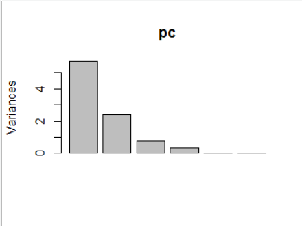
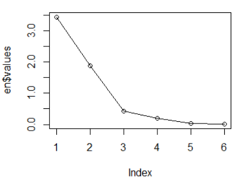

## 요인분석

>변수들의 <u>상관성</u>을 바탕으로 변수를 정제하여 상관관계 분석이나 회귀분석에 설명변수(독립변수)로 사용된다.

- 다수의 변수를 대상으로 변수간의 관계를 분석하여 **공통차원**으로 축약하는 통계기법
- **데이터를 축소**하는 변수의 정제 과정
- 여러 가지 항목들을 **비슷한 항목으로 묶는 것**으로 여러 변수 사이에 존재하는 **상호관계를 분석**하여 타당성을 검정하고, 공통으로 속해있는 차원이나 요인들을 밝혀냄으로써 변수를 축소하는 과정
  - 탐색적 요인분석 – 요인분석을 할 때 사전에 어던 변수끼리 묶어야 한다는 <u>전제를 두지 않고</u> 분석하는 방법	
  - 확인적 요인 분석 – 사전에 묶일 것으로 기대되는 항목끼리 묶여 지는지를 조사하는 방법  

### 요인 분석 전제조건 

- 하위요인으로 구성되는 데이터 셋이 준비되어 있어야 한다
- 분석에 사용되는 변수는 **등간척도**나 **비율척도**이어야 하며, 표본의 크기는 **최소 50개 이상**이 바람직하다
- 요인분석은 상관관계가 높은 변수들까리 **그룹화**하는 것이므로 변수 간의 상관관계가 매우 낮다면 (<u>보통 ±3 이하</u>) 그  자료는 요인분석에 적합하지 않다

### 요인 분석 (Factor Analysis) 목적 ***

- 자료의 요약 : 변인을 몇 개의 공통된 변인으로 묶음
- 변인 구조 파악 : 변인들의 상호관계 파악(독립성등)
- 불필요한 변인 제거 : 중요도가 떨어진 변수 제거
- 측정 도구 타당성 검증 : 변인들이 동일한 요인으로 묶이는지 확인  

### 요인 분석에 대한 활용 방안  ***

- 측정 도구가 정확히 측정했는지를 알아보기 위해서 측정 변수들이 동일한 요인으로 묶이는지를 검정한다(**타당성 검정**)
- 변수들의 상관관계가 높은 것끼리 묶어서 변수를 정제한다. (**변수 축소**)
- 변수의 중요도를 나타내는 요인적재량이 0.4 미만이면 설명력이 부족한 요인으로 판단하여 제거한다 (변수 제거)
- 요인분석에서 얻어지는 결과를 이용하여 상관분석이나 회귀분석의 설명변수로 활용한다.

### 공통요인으로 변수 정제

- 특정 항목으로 묶여 지는데 사용되는 요인수 결정은 주성분 분석방법과 상관계수 행렬을 이용한 초기 고유값을 이용한다.
  - 단계1] 주성분 분석 - 변동량(분산)에 영향을 주는 주요 성분을 분석하는 방법으로 요인분석에서 사용될 요인의 개수를 결정하는데 주로 이용된다.
  - 단계2] 고유값으로 요인수 분석 – 고유값이란 어떤 행렬로부터 유도되는 실수값을 의미한다. 일반적으로 변화량의 (총분산)을 기준으로 요인수를 결정하는데 이용된다. 
-  상관계수 행렬을 대상으로 **초기** **고유값**(행렬) 요인수 분석
-  **eigen()**은 상관계수 행렬을 대상으로 초기 고유값과 고유벡터를 계산하는 함수이다.


#### 공통요인으로 변수를 정제하는 요인분석

1. 주성분 분석

```R
# 6개 과목(s1~s6)
# 점수벡터 (5점 만점, 척도 :5 )
> s1 <- c(1, 2, 1, 2, 3, 4, 2, 3, 4, 5) #자연과학
> s2 <- c(1, 3, 1, 2, 3, 4, 2, 4, 3, 4) #물리화학
> s3 <- c(2, 3, 2, 3, 2, 3, 5, 3, 4, 2) #인문사회
> s4 <- c(2, 4, 2, 3, 2, 3, 5, 3, 4, 1) #신문방송
> s5 <- c(4, 5, 4, 5, 2, 1, 5, 2, 4, 3) #응용수학
> s6 <- c(4, 3, 4, 4, 2, 1, 5, 2, 4, 2) #추론통계
> name <-1:10 #문항 이름

> #데이터프레임 생성
> subject <- data.frame(s1,s2,s3,s4,s5,s6)
> subject
   s1 s2 s3 s4 s5 s6
1   1  1  2  2  4  4
2   2  3  3  4  5  3
3   1  1  2  2  4  4
4   2  2  3  3  5  4
5   3  3  2  2  2  2
6   4  4  3  3  1  1
7   2  2  5  5  5  5
8   3  4  3  3  2  2
9   4  3  4  4  4  4
10  5  4  2  1  3  2

> str(subject)
'data.frame':	10 obs. of  6 variables:
 $ s1: num  1 2 1 2 3 4 2 3 4 5
 $ s2: num  1 3 1 2 3 4 2 4 3 4
 $ s3: num  2 3 2 3 2 3 5 3 4 2
 $ s4: num  2 4 2 3 2 3 5 3 4 1
 $ s5: num  4 5 4 5 2 1 5 2 4 3
 $ s6: num  4 3 4 4 2 1 5 2 4 2

#주성분 분석으로 요인수 구하기
#주성분 분석 수행 함수
> pc <- prcomp(subject) # scale = TRUE

> summary(pc)
Importance of components:
                         PC1    PC2     PC3     PC4
Standard deviation     2.389 1.5532 0.87727 0.56907
Proportion of Variance 0.616 0.2603 0.08305 0.03495
Cumulative Proportion  0.616 0.8763 0.95936 0.99431
                           PC5     PC6
Standard deviation     0.19315 0.12434
Proportion of Variance 0.00403 0.00167
Cumulative Proportion  0.99833 1.00000

> plot(pc)
```



2. 고유값으로 요인 수 분석

   ```R
   > #고유값으로 요인 수 분석
   > en <- eigen(cor(subject)) #values : 고유값, $vectors : 고유벡터
   > names(en) #"values", "vectors"
   [1] "values"  "vectors"
   
   > en$values
   [1] 3.44393944 1.88761725 0.43123968 0.19932073
   [5] 0.02624961 0.01163331
   
   > en$vectors
              [,1]         [,2]        [,3]       [,4]
   [1,] -0.4062499 -0.351093036  0.63460534  0.3149622
   [2,] -0.4319311 -0.400526644  0.11564711 -0.4422216
   [3,]  0.2542077 -0.628807884 -0.06984072  0.3339036
   [4,]  0.3017115 -0.566028650 -0.37734321 -0.2468016
   [5,]  0.4763815  0.008436692  0.58035475 -0.6016209
   [6,]  0.5155637  0.021286661  0.31595023  0.4133867
               [,5]        [,6]
   [1,]  0.45699508  0.03041553
   [2,] -0.57042232  0.34452594
   [3,] -0.35389906 -0.54622817
   [4,]  0.50326085  0.36333366
   [5,]  0.05643527 -0.26654314
   [6,] -0.28995329  0.61559319
   
   > en$values #values : 고유값(스칼라) 보기
   [1] 3.44393944 1.88761725 0.43123968 0.19932073
   [5] 0.02624961 0.01163331
   
   > plot(en$values,type="o") #고유값을 이용한 시각화
   ```

   

   **고유값이 급격하게 감소하는 1~3 변수3개를 주성분 변수를 가정할 수 있다.**


*참고해 상관관계를 보면 s1~s2, s3~s4, s5~s6간 상관관계가 있다.*


### 변수간의 상관관계 분석과 요인분석

단계1] 상관관계 분석 – 변수 간의 상관성으로 공통요인 추출

단계2] 요인 회전법 적용 – 요인 해석이 어려운 경우 어느 한 요인을 높게 나타내기 위해서 요인축을

 회전하는 방법이 있다. 베리멕스 회전법을 기본으로 사용한다.

 `factanal(dataset, factors=요인수, rotation=“요인회전법“ ) `
`scores =“ 요인점수 계산 방법＂`

#### 베리맥스 요인회전법

- 요인분석을 실시하면 요인행렬이 구해지는데, 이 행렬은 어떤 변수들이 어떤 요인에 의해 높게 관계 되어 있는지를 보여주지 않는다.

- 따라서 요인축의 회전을 통해서 특정 변수가 어떤 요인과 관계가 있는지를 나타내주어야 한다.

- 요인회전법은 직각회전과 사각회전 방식이 있다.

- 직각회전 방식인 베리멕스(varimax)는 요인행렬의 열(Column)에 위치한 변수들의 분산 합계가 최대화되도록 요인 적재량 +1, -1, 0에 가깝도록 해주는 회전법으로 각 요인 간의 상관관계가 없다고 자정한 경우 사용되는 방법이다.

  ```R
  > #베리맥스 요인 회전법
  > result<-factanal(subject,factors = 2,rotation="varimax")
  > result
  
  Call:
  factanal(x = subject, factors = 2, rotation = "varimax")
  
  Uniquenesses:
     s1    s2    s3    s4    s5    s6 
  0.250 0.015 0.005 0.136 0.407 0.107 
  
  Loadings:
     Factor1 Factor2
  s1  0.862         
  s2  0.988         
  s3          0.997 
  s4 -0.115   0.923 
  s5 -0.692   0.338 
  s6 -0.846   0.421 
  
                 Factor1 Factor2
  SS loadings      2.928   2.152
  Proportion Var   0.488   0.359
  Cumulative Var   0.488   0.847
  
  Test of the hypothesis that 2 factors are sufficient.
  The chi square statistic is 11.32 on 4 degrees of freedom.
  The p-value is 0.0232 
  ```

  **베리맥스 요인회전법을 적용해 요인 분석 수행 p-value는 0.0232로 유의수준에 해당하는 0.05보다 적다.** **따라서 요인수로는 부족하다는 의미**

  ==> 요인수를 늘리면 ?

  ```R
  > result<-factanal(subject,factors = 3,rotation="varimax",scores="regression")
  > result
  
  #요인분석결과에서 만약 p-value 값이 0.05 미만이면 요인수가 부족하다는 의미로 요인수를 늘려서 다시 분석을 수행해야 한다.
  
  #Uniqueness항목은 유효성을 판단하여 제시한 값으로 통상 0.5이하이면 유효한 것으로 본다
  
  #Loading 항목은 요인 적재값(Loadings)를 보여주는 항목으로 각 변수와 해당 요인 간의 상관관계계수를 제시한다. 
  
  #요인 적재값(요인 부하량)이 통상 +0.4 이상이면 유의하다고 볼 수 있다.+0.4 미만이면 설명력이 부족한 요인(중요도가 낮은 변수)으로 판단할 수 있다.
  
  #SS loadings 항목은 각 요인 적재값의 제곱의 합을 제시한 값으로 각 요인의 설명력을 보여준다.
  
  #Proportion Var 항목은 설명된 요인의 분산 비율로 각 요인이 차지하는 설명력의 비율이다.
  
  #Cumulative Var 항목은 누적 분산 비율로 요인의 분산 비율을 누적하여 제시한 값으로 정보손실이 너무 크면 요인분석의 의미가 없어진다.
  
  Call:
  factanal(x = subject, factors = 3, scores = "regression", rotation = "varimax")
  
  Uniquenesses:
     s1    s2    s3    s4    s5    s6 	#0.5 이하면 유효하다.
  0.005 0.056 0.051 0.005 0.240 0.005 
  
  Loadings:
     Factor1 Factor2 Factor3
  s1 -0.379           0.923 
  s2 -0.710   0.140   0.649 
  s3  0.236   0.931   0.166 
  s4  0.120   0.983  -0.118 
  s5  0.771   0.297  -0.278 
  s6  0.900   0.301  -0.307 
  
                 Factor1 Factor2 Factor3
  SS loadings      2.122   2.031   1.486
  Proportion Var   0.354   0.339   0.248
  Cumulative Var   0.354   0.692   0.940 #(1-0.940 =0.06 :적정수준)
  
  The degrees of freedom for the model is 0 and the fit was 0.7745
  ```

  