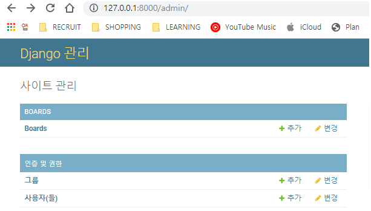

## ORM (Object Relational Mapping)

### MTV (MVC)

> 모델 / 템플릿(뷰) / 뷰(컨트롤러)

#### 데이터베이스의 기본 구조

- 쿼리 : 데이터를 질의하는, 조회하는 명령어
- DB : 체계화된 데이터의 모임
- 스키마 : DB 자료의 구조, 표현방법, 관계를 정의한 구조
- 테이블 
  	필드 : 컬럼
    	레코드 : 데이터

## 장고 - ORM

- 장점 : 

  sql을 몰라도 DB접근 가능하며 쉽게 사용 가능

  클래스의 인스턴스를 생성하는 방법으로 ORM을 다루는데, sql이 길면 해석하는데 시간이 걸리는데, ORM의 경우 코드의 가독성이 좋다.

  객체지향으로 접근 가능해서 생상성이 좋아진다.

  mapping정보가 확실해서 ERD 보는것의 의존도가 낮아진다.(?)

  ORM은 독립적으로 작성되어 있고, 해당객체들을 재활용 할 수 있다. 그렇기에 모델에서 가공된 데이터를 컨트롤러(views.py)에 의해 뷰(templates)와 합쳐지는 형태로 디자인 패턴을 견고하게 다지는데 유리

  객체 재생산성이 좋기떄문에 MVC패턴을 좀더 견고하게 만들어 준다.

  별도 mysql설치해도 , 원래는 query 문이 조금씩 다른데, ORM이 기본적으로 설치되어 있어 이 부분에서 완화된다.

  

- 단점 : 

  클래스 설계시 보다 신중해야 함, 대규모 프로젝트에서는 난이도가 높아질 수 있다, 속도가 느려질 수 있기 때문


`python manage.py shell`  파이썬 쉘 실행

```python
class Person :
    name : "사람의 이름"
    age : "나이를 먹어가죠"
    def greeting(self):
        print(f'{self.name}이 인사를 합니다')
    def eating(self):
        print(f'{self.name}이 먹네요')
	def aging(self):
        print(f'{self.name}은 현재 {self.age}살이지만  점점 나이를 더 먹겠죠.' 
		)

# 엔터를 한번 더 치면 빠져나온다

>>> justin = Person() 
>>> print(justin.name)
사람의 이름
>>> print(justin.age)
나이를 먹어가죠
>>> justin.age=19  # justin의 age 수정
>>> print(justin.age)
19
>>> print(Person.name)
사람의 이름

>>> print(Person.age)
나이를 먹어가죠
>>> justin.greeting()
사람의 이름이 인사합니다.
>>> justin.name = justin
>>> justin.name = "수능보는 justin"
>>> justin.greeting
<bound method Person.greeting of <Person object at 0x000001E41C463B48>>
>>> justin.greeting()
수능보는 justin이 인사합니다.
>>> justin.aging()
수능보는 justin은 현재 19살이지만  점점 나이를 더 먹겠죠.
>>> exit() # 종료! 
```


### Model

- 모델은 단일 데이터에 대한 정보를 가지고 있다.

- 필수적인 필드(컬럼)과 데이터(레코드)에 대한 정보를 포함

- 각각의 모델은 단일 데이터베이스 테이블과 매핑

- 사용자가 저장하는 데이터들의 필수적인 필드(컬럼) 동작을 포함

- 옵션 

  - `필드옵션` : 필드마다 고유 옵션이 존재, 공통 적용 옵션도 있음
  - null (DB 옵션) : DB 필드에 NULL 허용 여부 (디폴트 : False)
  - unique (DB 옵션) : 유일성 여부 (디폴트 : False)
  - blank : 입력값 유효성 (validation) 검사 시에 empty 값 허용 여부 (디폴트 : False)
  - default : 디폴트 값 지정. 값이 지정되지 않았을 때 사용
  - verbose_name : 필드 레이블. 지정되지 않으면 필드명이 쓰여짐
  - validators : 입력값 유효성 검사를 수행할 함수를 다수 지정
    - 각 필드마다 고유한 validators 들이 이미 등록되어있기도 함
    - 예 : 이메일만 받기, 최대길이 제한, 최소길이 제한, 최대값 제한, 최소값 제한 등
  - choices (form widget 용) : select box 소스로 사용
  - help_text (form widget 용) : 필드 입력 도움말
  - auto_now_add : Bool, True 인 경우, 레코드 생성시 현재 시간으로 자동 저장

  

#### 실습


boards --- models.py

```python
from django.db import models

class Board(models.Model):
    title=models.CharField(max_length=10)
    content=models.TextField()
    # 글이 생성될 때 자동으로 날짜 생성 auto_now_add
    # 장고는 pk값을 자동으로 부여해줌
    # 등록
    created_at=models.DateTimeField(auto_now_add=True)
```

#### makemigrations

```shell
$ python manage.py makemigrations
Migrations for 'boards':
  boards\migrations\0001_initial.py
    - Create model Board
(venv) 
```

--- > migrations 폴더 생성과 동시에 0001_initail.py 파일이 생성된다. 
		<u>id에 자동으로 PK가 부여된 것을 확인할 수 있다.</u>

```python
# Generated by Django 2.2.7 on 2019-11-14 06:16

from django.db import migrations, models


class Migration(migrations.Migration):

    initial = True

    dependencies = [
    ]

    operations = [
        migrations.CreateModel(
            name='Board',
            fields=[
                ('id', models.AutoField(auto_created=True, primary_key=True, serialize=False, verbose_name='ID')),
                ('title', models.CharField(max_length=10)),
                ('content', models.TextField()),
                ('created_at', models.DateTimeField(auto_now_add=True)),
                ('updated_at', models.DateTimeField(auto_now=True)),
            ],
        ),
    ]

```


수정 ( 추가 ) 도 가능함 (boards - models.py)

```python
#from django.db import models

#class Board(models.Model):
    #title=models.CharField(max_length=10)
    #content=models.TextField()
    # 글이 생성될 때 자동으로 날짜 생성 auto_now_add
    # 장고는 pk값을 자동으로 부여해줌
    # 등록
    #created_at=models.DateTimeField(auto_now_add=True)
    
    업데이트(수정)시간 관리
    updated_at=models.DateTimeField(auto_now=True)
```


추가 후 makemigrations 하면 **0002_board_updated_at.py** 0002 번 updated.py가 생성된다.

```shell
$ python manage.py makemigrations
Migrations for 'boards':
  boards\migrations\0002_board_updated_at.py
    - Add field updated_at to board
(venv)
```


#### query 확인

`python manage.py sqlmigrate boards 0001`

```shell
$ python manage.py sqlmigrate boards 0001

BEGIN;
--
-- Create model Board
--
CREATE TABLE "boards_board" ("id" integer NOT NULL PRIMARY KEY AUTOINCREMENT, "title" varchar(10) NOT NULL, "content" text NOT NULL, 
"created_at" datetime NOT NULL);
COMMIT;
(venv) 

#자동으로 not null옵션이 들어간 것을 확인 가능!
```


!!!!	 **아직 DB가 생성되지 않은 명세서일 뿐**	!!!!
DB 적용 유무를 확인해보면 ?

```shell
$ python manage.py showmigrations
admin
 [ ] 0001_initial
 [ ] 0002_logentry_remove_auto_add
 [ ] 0003_logentry_add_action_flag_choices
auth
 [ ] 0001_initial
 [ ] 0002_alter_permission_name_max_length
 [ ] 0003_alter_user_email_max_length
 [ ] 0004_alter_user_username_opts
 [ ] 0005_alter_user_last_login_null
 [ ] 0006_require_contenttypes_0002
 [ ] 0007_alter_validators_add_error_messages
 [ ] 0008_alter_user_username_max_length
 [ ] 0009_alter_user_last_name_max_length
 [ ] 0010_alter_group_name_max_length
 [ ] 0011_update_proxy_permissions
# 여기 !####################################
boards
 [ ] 0001_initial
 [ ] 0002_board_updated_at
 #두가지가 준비된것을 확인 가능! 빈칸은 아직 DB가 적용되지 않았음을 확인 할 수 있다.
#############################################
contenttypes
 [ ] 0001_initial
 [ ] 0002_remove_content_type_name
sessions
 [ ] 0001_initial
(venv) 
```


DB 적용하기 - `python manage.py migrate`

```shell
$ python manage.py migrate
Operations to perform:
  Apply all migrations: admin, auth, boards, contenttypes, sessions
Running migrations:
  Applying contenttypes.0001_initial... OK
  Applying auth.0001_initial... OK
  Applying admin.0001_initial... OK
  Applying admin.0002_logentry_remove_auto_add... OK
  Applying admin.0003_logentry_add_action_flag_choices... OK
  Applying contenttypes.0002_remove_content_type_name... OK
  Applying auth.0002_alter_permission_name_max_length... OK
  Applying auth.0003_alter_user_email_max_length... OK
  Applying auth.0004_alter_user_username_opts... OK
  Applying auth.0005_alter_user_last_login_null... OK
  Applying auth.0006_require_contenttypes_0002... OK
  Applying auth.0007_alter_validators_add_error_messages... OK
  Applying auth.0008_alter_user_username_max_length... OK
  Applying auth.0009_alter_user_last_name_max_length... OK
  Applying auth.0010_alter_group_name_max_length... OK
  Applying auth.0011_update_proxy_permissions... OK
  Applying boards.0001_initial... OK
  Applying boards.0002_board_updated_at... OK
  Applying sessions.0001_initial... OK
(venv) 
```


적용 유무 다시 확인해보면 X : 적용됨을 의미

```
$ python manage.py showmigrations
admin
 [X] 0001_initial
 [X] 0002_logentry_remove_auto_add
 [X] 0003_logentry_add_action_flag_choices
auth
 [X] 0001_initial
 [X] 0002_alter_permission_name_max_length
 [X] 0003_alter_user_email_max_length
 [X] 0004_alter_user_username_opts
 [X] 0005_alter_user_last_login_null
 [X] 0006_require_contenttypes_0002
 [X] 0007_alter_validators_add_error_messages
 [X] 0008_alter_user_username_max_length
 [X] 0009_alter_user_last_name_max_length
 [X] 0010_alter_group_name_max_length
 [X] 0011_update_proxy_permissions
boards
 [X] 0001_initial
 [X] 0002_board_updated_at
contenttypes
 [X] 0001_initial
 [X] 0002_remove_content_type_name
sessions
 [X] 0001_initial
(venv) 
```

sqlite3.db 를 읽기 위해 다운 sqlite dll과 tools를 다운 받는다

`vim ~/.bashrc` 로 들어가 
`alias sqlite="c:/sqlite3.exe"` 설정 후 
`source ~/.bashrc` 로 적용 

`$ sqlite db.sqlite3` 입력하면 ?

```sql
SQLite version 3.30.1 2019-10-10 20:19:45
Enter ".help" for usage hints.
sqlite> .tables
auth_group                  boards_board
auth_group_permissions      django_admin_log
auth_permission             django_content_type
auth_user                   django_migrations
auth_user_groups            django_session
auth_user_user_permissions
/*테이블 확인*/

/*구조 확인!*/
sqlite> .schema boards_board
CREATE TABLE IF NOT EXISTS "boards_board" ("id" integer NOT NULL PRIMARY KEY AUTOINCREMENT, "title" varchar(10) NOT NULL, "content" text NOT NULL, "created_at" datetime NOT NULL, "updated_at" datetime NOT NULL);
/*다른 것도 구조 확인*/
sqlite> .schema auth_group
CREATE TABLE IF NOT EXISTS "auth_group" ("id" integer NOT NULL PRIMARY KEY AUTOINCREMENT, "name" varchar(150) NOT NULL UNIQUE);
```


DB 내용 확인

``` shell
$ python manage.py shell
Python 3.7.5 (tags/v3.7.5:5c02a39a0b, Oct 15 2019, 00:11:34) [MSC v.1916 64 bit (AMD64)] on win32
Type "help", "copyright", "credits" or "license" for more information.
(InteractiveConsole)
>>> from boards.models import Board
>>> Board.objects.all()
<QuerySet []>
#내용이 없어 빈칸으로 나온다.
```

 DB에 데이터 넣기

```shell
>>> board = Board() #인스턴스 생성

########### 데이터 객체 만드는 방법 1 ############
>>> board.title = "first"
>>> board.content = "Django"
>>> board
<Board: Board object (None)>
>>> board.save() # 저장해야 적용된다.
>>> board
<Board: Board object (1)>
#하나가 생성됐음을 확인!

############ 방법 2 ########################
>>> board = Board(title = "second" , content = "django")  
#내용을 한번에 입력 가능!
>>> board.save() # 저장!
>>> board
<Board: Board object (2)>


############ 방법 3 ########################
#내용을 한줄로 처리!
#objects는 인스턴스 즉, UI다.
>>> Board.objects.create(title = "third", content = "django") # 저장이 필요 없다
<Board: Board object (3)>
```

DB 내용 확인 - **반환은 List 로** 

```shell
>>> Board.objects.all()
<QuerySet [<Board: Board object (1)>, <Board: Board object (2)>, <Board: Board object (3)>]>
```

* 참고 ) 내용을 좀더 편하게 보기위해서

  boards - models.py

  ```python
  from django.db import models
  
  # Create your models here.
  class Board(models.Model):
      title = models.CharField(max_length=10) #CharField는최대 글자를 설정해 주어야 한다.
      content = models.TextField() #Text Field는 maxlength주어도 DB에서 글자수 제한이 주어지지 않는다.
      created_at = models.DateTimeField(auto_now_add=True) #글이 생성되면 날짜가 자동으로 저장되기 위해서 auto_now_add
      updated_at = models.DateTimeField(auto_now=True) #수정될때마다 시간 자동으로 저장하기 위해서
      #장고는 아이디를 자동으로 만들어주기 때문에 컬럼명만 신경 쓰면 된다! VO생성 안해도 된다
  
      
  ####### 요고 ########    추가 후 migrations & migrate할 필요는 없음
  
  def __str__(self):
          return f'{self.id} : {self.title}'
  ```

  

### ORM 변경순서

1. models.py 작성
2. makemigration : migration 파일 (명세서) 생성 (showmigration ,,,)
3. migrate : 실제 적용되는 부분

###  DB에 데이터 객체를 만드는 3가지 방법

1. board = Board()

   board.title = "값"

   board.save()

2. board = Board(title = "값" , content = "값")

   board.save()

3. board = Board.objects.create(title="값" , content = "값")

   - 세번째 방법은 세이브 없어도 적용!

---

get 
	: 값 1개만 가져올 수 있음

```python
>>> from boards.models import Board
>>> board =  Board()
>>> board.title = "fourth"
>>> board.content = "django"
>>> board.id
>>> board.created_at
>>> board.save()
>>> board.id
4
>>> board.created_at
datetime.datetime(2019, 11, 14, 5, 6, 2, 549530, tzinfo=<UTC>)


>>> board2 = Board()
>>> board2.title = "12345678901"
>>> board2.full_clean() 		 ###### full_clean() : 바로 확인 가능한 메서드 #####
#현재 설정 내용 확인 가능!
Traceback (most recent call last):
  File "<console>", line 1, in <module>
  File "C:\Users\student\Documents\GitHub\STUDY\Python\Framword(Django)\venv\lib\site-packages\django\db\models\base.py", line 1203, 
in full_clean
    raise ValidationError(errors)
django.core.exceptions.ValidationError: {'title': ['이 값이 최대 10 개의 글자인지 확인하세요(입력값 11 자).'], 'content': ['이 필드는
 빈 칸으로 둘 수 없습니다.']}
 
>>> b = Board.objects.all()
>>> b #쿼리 셋이 리스트 형식으로 날아온다. 인덱스로 접근 가능
<QuerySet [<Board: 1 : first>, <Board: 2 : second>, <Board: 3 : third>, <Board: 4 : fourth>]>
#인덱스로 불러옴을 확인할 수 있다.
>>> b[0].title
'first'
#get(pk=값)으로도 확인 가능
>>> b = Board.objects.get(pk = 3)
>>> b
<Board: 3 : third>
>>> b = Board.objects.get(title='second') 
>>> b
<Board: 2 : second>
```


filter
	: 여러개 불러옴, 인덱스로 접근해야 업데이트 가능함.

```python
>>> Board.objects.create(title='second' , content = '두번째') 
<Board: 5 : second>

############ get으로 불렀을 때 #############    : 오류        
>>> Board.objects.get(title = "second")
Traceback (most recent call last):
  File "<console>", line 1, in <module>
  File "C:\Users\student\Documents\GitHub\STUDY\Python\Framword(Django)\venv\lib\site-packages\django\db\models\manager.py", line 82, in manager_method
    return getattr(self.get_queryset(), name)(*args, **kwargs)
  File "C:\Users\student\Documents\GitHub\STUDY\Python\Framword(Django)\venv\lib\site-packages\django\db\models\query.py", line 412, 
in get
    (self.model._meta.object_name, num)
boards.models.Board.MultipleObjectsReturned: get() returned more than one Board -- it returned 2!
#그렇기에 두개로 저장된건 오류난다

############ filter 로 불렀을 때 #############    
>>> Board.objects.filter(title='second')
<QuerySet [<Board: 2 : second>, <Board: 5 : second>]>
#그래서 filter를 사용하면 여러개 불러올 수 있다.
```


쿼리문 슬라이스  `b[1:3]`

```python
>>> b  = Board.objects.all()
>>> b
<QuerySet [<Board: 1 : first>, <Board: 2 : second>, <Board: 3 : third>, <Board: 4 : fourth>, <Board: 5 : second>]>


#원하는 부분만 불러올 수 있다.
>>> b[1:3]
<QuerySet [<Board: 2 : second>, <Board: 3 : third>]>
```


타입 확인

```python
>>> type(b)  
<class 'django.db.models.query.QuerySet'>
>>> type(b[0]) 
<class 'boards.models.Board'>
```


포함 문자 쿼리 셋 불러오기

1. contains
2. startwith
3. endswith
4. +++ 업데이트

```python
#contains
>>> b = Board.objects.filter(title__contains = "sec") 
>>> b
<QuerySet [<Board: 2 : second>, <Board: 5 : second>]>

#startswith
>>> b = Board.objects.filter(title__startswith="fi") 
>>> b
<QuerySet [<Board: 1 : first>]>

#endswith
>>> b  = Board.objects.filter(title__endswith = "d")
>>> b
<QuerySet [<Board: 2 : second>, <Board: 3 : third>, <Board: 5 : second>]

#DB 내용 업데이트!
>>>> b = Board.objects.get(pk=1) 
>>> b
<Board: 1 : first>
>>> type(b)
<class 'boards.models.Board'>

>>> b.title = "hello orm"
>>> b.save()
#저장을 해야 내용이 바뀐다.
>>> b = Board.objects.get(pk=1) 
>>> b
<Board: 1 : hello orm>
# hello orm 으로 바뀌어다.
```


삭제

```python
>>> b = Board.objects.get(pk=3)
>>> b
<Board: 3 : third>
>>> b.delete()
(1, {'boards.Board': 1})
>>> Board.objects.all()
<QuerySet [<Board: 1 : hello orm>, <Board: 2 : second>, <Board: 4 : fourth>, <Board: 5 : second>]>
#3번 사라진것 확인

>>> b = Board.objects.get(pk=3)
Traceback (most recent call last):
  File "<console>", line 1, in <module>
  File "C:\Users\student\Documents\GitHub\STUDY\Python\Framword(Django)\venv\lib\site-packages\django\db\models\manager.py", line 82, in manager_method
    return getattr(self.get_queryset(), name)(*args, **kwargs)
  File "C:\Users\student\Documents\GitHub\STUDY\Python\Framword(Django)\venv\lib\site-packages\django\db\models\query.py", line 408, 
in get
    self.model._meta.object_name
boards.models.Board.DoesNotExist: Board matching query does not exist.
#3번이 사라짐을 확인한다.
```


### admin	:  `createsuperuser`

> shell로 관리하기 어려우니 훨씬 편한 admin페이지를 이용한다

1. `$ python manage.py createsuperuser`

   아이디, 비밀번호 생성

2. $ python manage.py runserver

   이 때 들어가면 boards 가 없다

3. admin.py 에서 등록해야 나온다.

   ```python
   from django.contrib import admin
   from .models import Board
   #현재 App위치에 있는 models에 있는 Board 불러오기
   
   # Register your models here.
   admin.site.register(Board)
   ```



4. board 커스터마이징

   ```python
   from django.contrib import admin
   from .models import Board
   
   class BoardAdmin(admin.ModelAdmin):
       fields = ['content','title']
       list_display=["title","updated_at",]
       list_filter=["updated_at"]
       search_fields=["title","content"]
   
   admin.site.register(Board,BoardAdmina)
   ```

   

